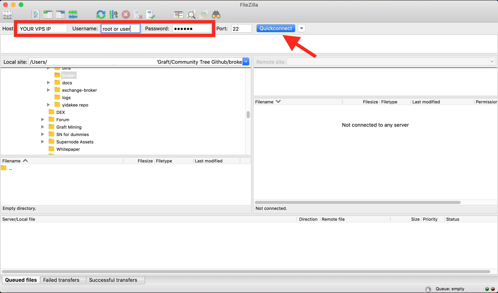

# Testnet Testing Framework for Graft Alpha Testers
---

## General Considerations

---

IMPORTANT:

Both iPhone and iPad will stop sync'ing if the devices go to sleep. It is very likely that even after wake-up they will not gracefully resume sync. It is highly advised to go into settings and disable auto-lock. After that, sync'ing should work just fine, but can take as much as 45 minutes to an hour - depending on how far back it was last sync'ed.

---

We are on the verge of Beta Mainnet release. It is imperative that all testnet participants
take testing a step further and report back with logs to the Graft development team.

The more, the better - the faster quality logs are submitted, the faster bugs are squashed, the faster we roll-out onto Mainnet.

The idea is very simple. Test RTA transactions and log the results. Then submit any relevant findings
to the team.

Successful instant RTA transactions do not require logging and reporting - this is expected behavior.

What does require logging are things like;

* Error Messages (ex: Something Went Wrong on the mobile wallet)
* Spinning Wheel when trying to pay for an item
* Failed transactions
* RTA successful, but took significantly more time than expected
* Any other unexpected behaviour

## Procedure;

Stop _graftnoded_ and _supernode_ is they are running.

Start _graftnoded_ with the extra flag to create a log file. You can name the file whatever you like
but it is recommended you give it a *.log extension

````bash
./graftnoded --testnet --log-file graftnoded.log
````

Next, fire up the _supernode_ much in the same way, though _supernode_ does not need --testnet flag

````bash
./supernode --log-file supernode.log
````

* IMPORTANT NOTE: These log files can grow VERY big VERY fast. 100mb (in multiple files) per couple of minutes. Ideally, you should start a testing round with _--log-file_ -  run your RTA tests, save the logs locally to send to the team, and then stop logging and delete the log files from your server until your next round of testing. I suggest you run tests for 10 - 20 minutes at a time.

* Logs will be saved in the following directories;

_graftnoded_

````bash
$HOME/.graft/testnet/
````

_supernode_

````bash
$HOME/<your_supernode_build_dir>/
````

## How To Collect Files

If you're a Linux power user, you know what to do. If you're not, the simplest and most intuitive is to use FileZilla (or any other similar sftp client).

This is assuming you are using a VPS - if you are using a local machine, life is much simpler, simply drag and drop the log files to your preferred location



On the left panel (your local machine), navigate to your preferred place to save the logs to.

On the right panel, navigate to the log location, and simply drag and drop to your preferred location on your local machine.


Once you have collected the logs, proceed to submit them.

## Submitting Log Files

Logs files are extremly useful, but unless you provide the team with some sort of back story, they will end up spending too much time scrolling page after page hunting for a needle in a haystack.

There will be a small questionnaire to fill out, so the Graft team understand your environment. Please be as accurate as possible!

Along with the log files and quick questionnaire we also ask you to describe the step leading to the error logs, it is imperative you describe step-by-step your actions, so the team can quickly zone into the relevant parts of the log.

Example of the wrong way to do it:


>Hi Graft devs. Here are the logs. Thank you

Example of the proper way to submit:


>Point-of-Sale wallet and mobile RTA wallet are fully sync'ed up, and both my Point-Of-Sale wallet and mobile wallet pointed to my own Supernode, using port 28690. On the Point of Sale I selected a product and clicked on "Checkout". Once the QR showed up, I scanned the QR, waited for the payment information to show up. When it showed up, I clicked pay, by then ....

> Sometimes I can perform RTA sales, other times I can't. I don't understand. I'm not doing anything different. The logs I'm sending contains both successful and unsuccessful RTA transactions. I cannot reproduce the behavior. Mobile wallet connected to HTTPS, POS wallet to my own Supernode. Sometimes after Checkout, after scanning QR I get "Waiting for payment details... "

The more descriptive, the better.

To submit your logs, please ZIP them up into one file and name it your Telegram / Discord handle.
Maximum file size is 1 GB.

Be sure to collect both Graftnoded logs and Supernode logs into one ZIP file.

ex:

> yidakee_test_5.zip

please fill out this Google forms and upload your ZIP file.

>https://docs.google.com/forms/d/1WzsLiqwfQQV9Yqbk-KVmUAl16nBeIMHtXmTznSQV1RQ/edit


Once you have saved your logs locally and submitted, it is recommended you delete them from the SuperNode server to avoid confusion with subsequent testing rounds.

If you need any help, feel free to contact Tiago (yidakee on Discord / @el_duderino_007 on Telegram) for assistance.

Live long and break stuff!

-yidakee
