# **Alpha 4.2 - Simple step-by-step Supernode setup instructions for non-Linux users**
---
_by: yidakee (aka el_duderino_007)_

## General considerations

* Instructions for BOTH Graft Official Testnet Master branch and Community Tree

* This is a bare minimum install recommended for linux newbies and troubleshooting purposes.

* This setup is **only for Testnet**, as it is a very insecure server setup.

* This guide is not intended for linux educational purposes, rather a simple copy/paste procedure to get your Supernode up an running and see it working properly and learn Supernode management, and later be able to follow more advanced setup guides.

## Requirements

* Any modern machine with at least 2 GB per core, 4 GB RAM
* VPS (_virtual private server_) recommended.

## Brief list of VPS poviders


| URL                          | Specs     | Bandwidth | Storage| Price/month     |
| -------------                |:---------:| :--------:| :-----:| :--------------:|
| https://vultr.com            | 2vCPU 4GB | 3 TB      | 60GB   |    $20          |
| https://try.digitalocean.com | 2vCPU 4GB | 4 TB      | 80GB   | $100 Free Trial |
| https://www.hetzner.com/     | 2vCPU 4GB | 20TB      | 40TB   |    4,90€        |
| https://contabo.com/         | 4 CPU 8GB | Unlimited | 200 GB |    4,99€        |
| https://www.linode.com/      | 2vCPU 4GB | 4TB       | 80GB   |    $20          |
| https://www.ovh.com/         | 2vCPU 7GB | ?         | 50GB   |    $26.40       |

* Link to Digital Ocean free $100 Trial (must provide Credit Card) - https://try.digitalocean.com/performance/

* Start by selecting a VPS provider, spin up a node selecting Ubuntu 18.04.

* Once you’ve fired up your node, `ssh` into the server and perform typical maintenance (note, it may not look exactly the same on your machine)


````bash
    sudo apt-get update
````

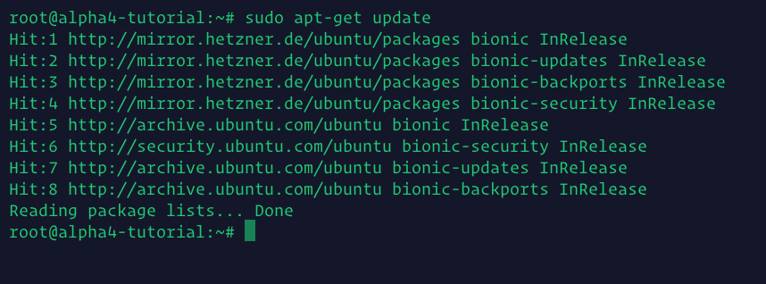

````bash
    sudo apt-get upgrade
````

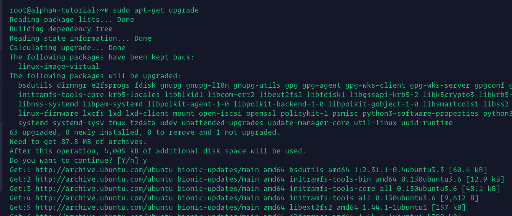


* If this window shows up, select the first option


* We will now install git

````bash
    sudo apt-get install -y git
````

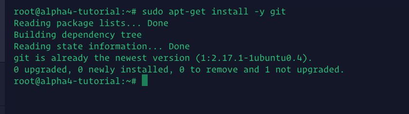


* Clone Graft Alpha 4 testnet code from GitHub repository
* You can choose either the Official Graft branch or the Community Tree branch

* For the Graft Official build, do;

````bash
      git clone --recursive -b alpha4 https://github.com/graft-project/graft-ng.git
````

* Otherwise, for the Graft Community Tree build do;

````bash
      git clone --recursive -b gc-alpha https://github.com/graft-community/graft-ng.git
````

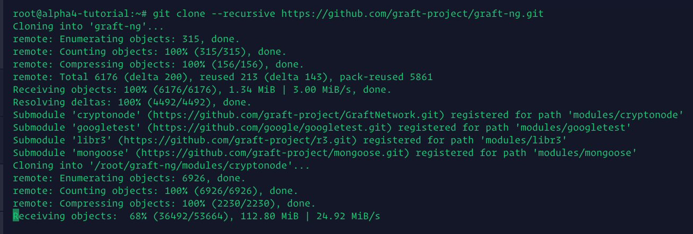

````bash
      cd graft-ng
      git submodule update --init --recursive
````

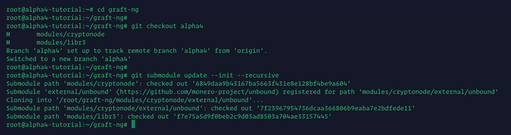

* Install dependencies

````bash
    sudo apt-get -y install build-essential cmake pkg-config libboost-all-dev libssl-dev libunwind8-dev liblzma-dev libldns-dev libexpat1-dev doxygen graphviz autoconf automake check libpcre3-dev rapidjson-dev libreadline-dev
````

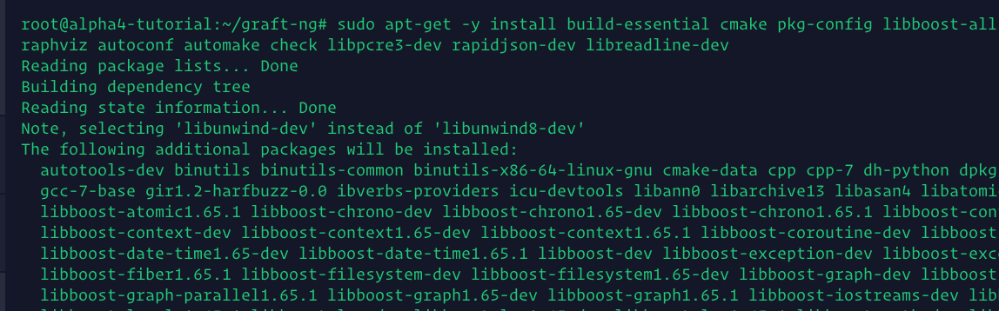

* Get back out of “graft-ng” directory, create a build directory, and enter it - this is where the actual Graft source code will be built.

````bash
    cd
    mkdir -p supernode
    cd supernode
````

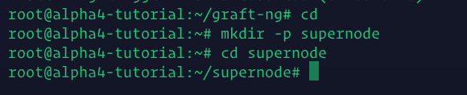

* Run “cmake” in this directory, using the source code

````bash
      cmake $HOME/graft-ng
````

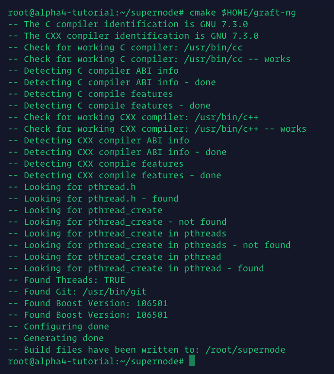

* Build the source code. This can take a while! (1h or more)

````bash
    make -j2
````

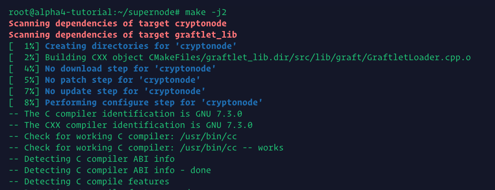

* Recommended build requires 8GB RAM, but if have less it is likely the build will fail at some point, as shown in the next image

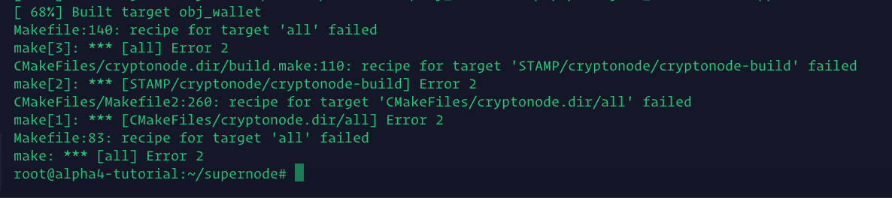

* Simply run `make -j2` again and it will eventually go through

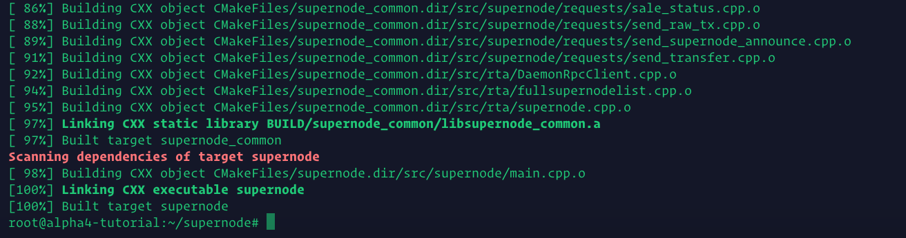


### Great! We’ve managed to install everything.

You now have;

* `graftnonded` - syncs the blockchain, has interactive commands
* `graft-wallet-cli` - wallet management, has interactive commands
* `supernode` - RTA/supernode functions, non-interactive

>`graftnoded` and `graft-wallet-cli` live in the directory;
`$HOME/supernode/BUILD/bin`

>`supernode` lives is;
`$HOME/supernode/`

* You need to run `graftnoded` first and let the blockchain fully sync.
* * First, lets run `graftnoded` and wait until it syncs up the blockchain - this may take a long time, around 3h at the time of writing.

````bash
    cd $HOME/supernode/BUILD/bin
    ./graftnoded --testnet
````
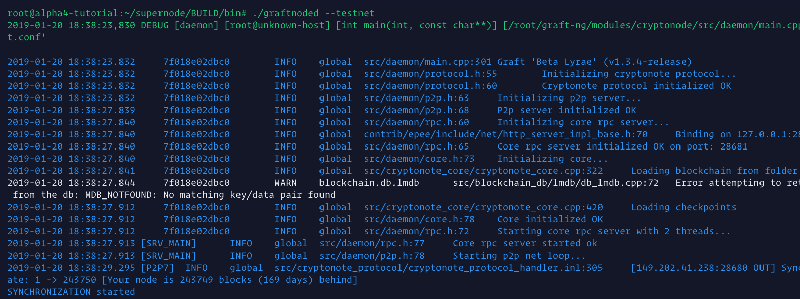

* Once finished, it will look like this

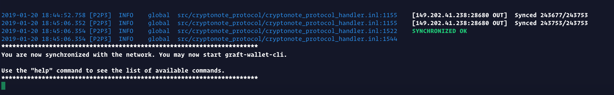

* Type `help` and press `Enter` to see the list of commands you can run to inspect the network. Check with `status` to double check your block height against the community block explorer - https://rta.graft.observer

When you’re up to block height, then you can safely run wallets, any wallet. But we need to create a specific wallet for your SuperNode, and send the staking amount to it.

The easiest way is to run `supernode` for a few seconds, and then stopping the process. It will create a stake-wallet automatically.

* **You will need to create a new Terminal** - if you close the terminal window, it will kill the current process, in this case `graftnoded` - in future tutorials we will explain how to use `screen` to solve this, but for now we're keeping it simple.

* So, open a new Terminal session and

````bash
    cd $HOME/supernode
    ./supernode
````

* Give is a brief few seconds, 5-10s, and then quit by CTRL+C, to stop the `supernode`server.

* Let’s open the stake-wallet to find the address to send funds to. By opening the wallet, you will be able to retrieve the mnemonic seed phrase for safe keeping. The actual stake-wallet is created in a hidden folder, here is how to access it;

````bash
    cd $HOME/supernode/BUILD/bin
    ./graft-wallet-cli --wallet-file ~/.graft/supernode/data/stake-wallet/stake-wallet --password "" --testnet --trusted-daemon
````

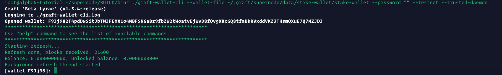

* Here you can type `help` too, to see all the command you can perform within the wallet, like for example `show_transfers`.

* Copy the wallet address, make sure it is a **testnet** address and starts with an **F**. Send the amount needed for the tiered node you wish to run, and wait until the balance is unlocked. If you don’t have testnet GRFT, ask in the testnet chat channel on Discord (https://discord.gg/a59J3Z) or Telegram (https://t.me/joinchat/F25OCUXOQ55qqHm_BZU4Sg)

### **Never ever use your mainnet wallet with real mainnet GRFT.**
<br/>


* Check your funds with `balance` and/or `refresh`

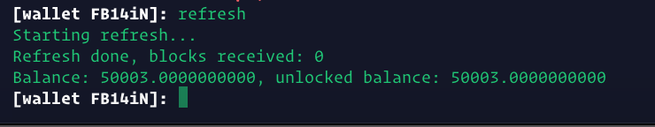

Once your balance is unlocked, you can start the supernode in the next step.

* Exit the wallet (or create a new Terminal session), navigate to the `$HOME/supernode` directory and start `supernode`
* In the wallet `exit`, then

````bash
    cd $HOME/supernode
    ./supernode
````

You should start seeing something like this:

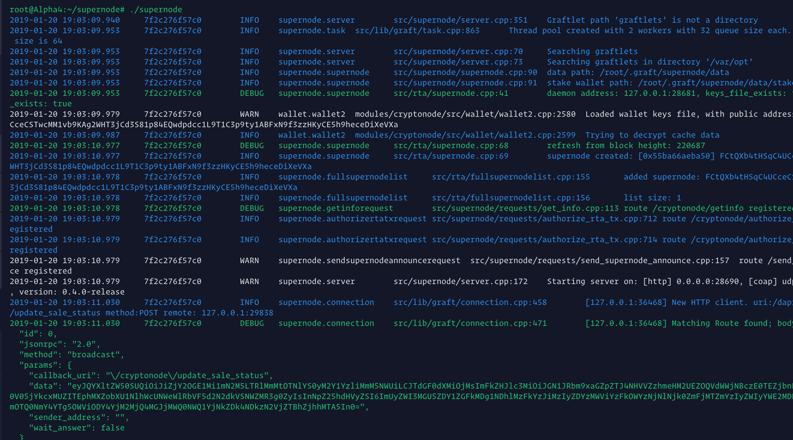

If you check back on the `graftnoded` Terminal, you will see this going on, as `graftnoded` and `supernode` are now talking to each other;

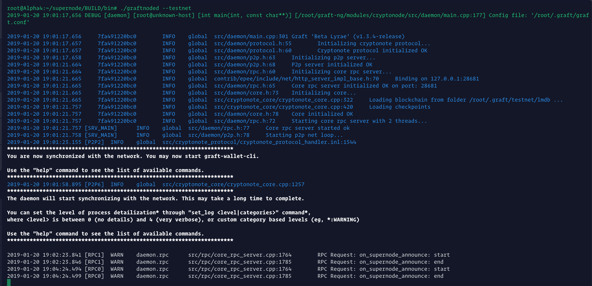


#### Congratulations!

You have a fully functioning Supernode live on Alpha 4 testnet, and should start getting rewards soon.

You will need test-GRFT to fund your Supernode. Head over to the official Graft Telegram RTA Testnet channel (https://t.me/joinchat/F25OCUXOQ55qqHm_BZU4Sg), or if you prefer Discord (https://discord.gg/ukjvUB)

Once there, read the pinned message on how to get some test-GRFT - or basically just ask!

You can now experiment with the Point-Of-Sale wallet to create some items, as well as the RTA Alpha testnet wallet - and see for yourself how RTA works. If all is well configured, should take 4 to 8 seconds to conclude a sale.

You can go into all your testnet wallet's settings and point them to your own supernode, for maximum efficiency of transaction processing. Simply add your Supernode IP and port 28690. This can also be configured through a URL using HTTPS.

Here is an extremely basic network monitoring tool I made, to make tesnet a little more visually appealing;

https://docs.google.com/spreadsheets/d/1MsPxWJkCBE4ElCy37TNuOtbX4SypPzbq5L6wCHpkN84/edit#gid=688880943

Also, here is Jason’s (a.k.a jagerman) testnet block explorer

https://rta.graft.observer

Have fun, and try to break stuff. Don’t forget to submit any findings!
