# GRAFT COMMUNITY
### Windows Compile Instructions For GRAFT NETWORK
##### By Patrick Durbin @SomethingGettingWrong
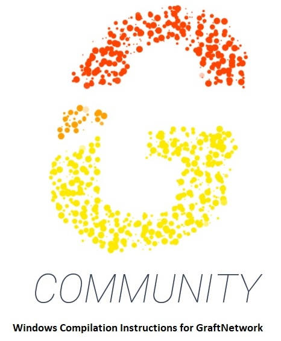

First head on over to the msys64 website. [MSYS2.ORG](https://www.msys2.org/)
Msys2 is a self contained executable for all intents and purposes is a posix with
bash built off of Arch Linux. It has a special toolset called Mingw-64. Mingw-w
takes native linux libraries and GNU compatible code and cross compiles static
executables for windows. All required libraries are selfcontained in the windows
executable.

#### Grab you a copy of the x64 version if you already know what it is here

[x64 Download link for Msys2](http://repo.msys2.org/distrib/x86_64/msys2-x86_64-20180531.exe)


Once you have this file downloaded. Execute it and install.

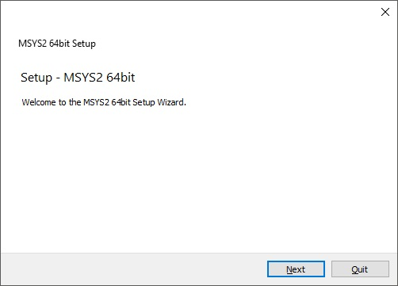

Please do not change from the current location `C:\` unless your comfortable with
editing the make file in the GraftNetwork git directory currently its expects the
path for msys64 to be on the `C:\`

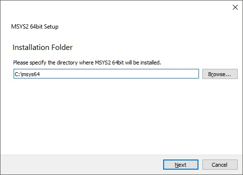
### Run your copy of msys64

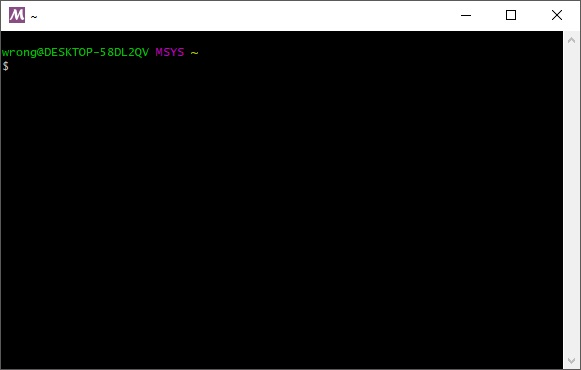

At the Bash type.
```
pacman -Syuu
```

This will update your terminal. The terminal will appear to freeze. This is normal. You have
just updated pacman. The Terminal needs to restart in order to continue updating. It has 
come to a halt as the old pacman was used to essentially replace itself.

Proceed with installation (Y) for yes when prompted with this next screen just exit


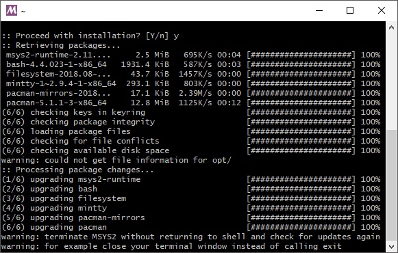

It will prompt with “ process are running in session” click okay to exit.

```
Edit the properties for the MSYS2 Shell
shortcut changing "msys2_shell.bat" to
"msys2_shell.cmd -mingw64"
```
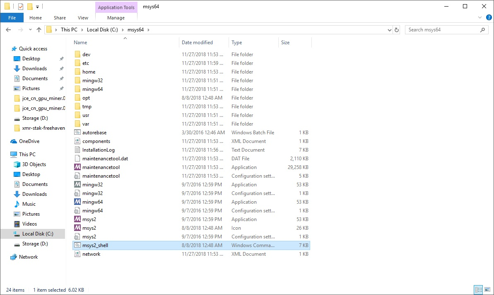
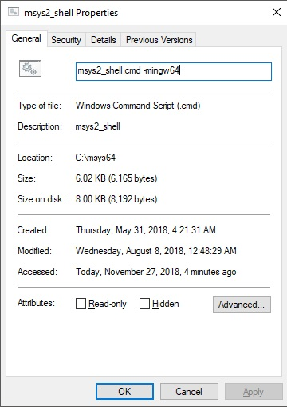

Double click the renamed batch file and again run the update command
```
pacman -Syuu
```
Hit Y for yes

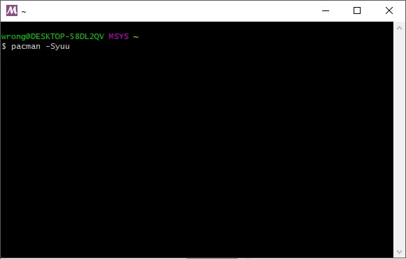


##### Please paste the following command into Msys
```
pacman -S mingw-w64-x86_64-toolchain make mingw-w64-x86_64-cmake
mingw-w64-x86_64-boost
```
This will download the toolchain used for cross compilation. The
Cmake version used to generate a windows compatible mingw-w
cmake compile instructions and boost dependencies C++ Libraries.

Please hit
enter.

Then hit Y
for yes

Now That you have your cross compilation set up you need to
spend some time getting the base developement libraries and
Graft Network specific dependiencies.
```
pacman -S base-devel
```
This will install the dependencies to compile under Arch(or in
this case your terminal)

Hit enter Then Y for yes

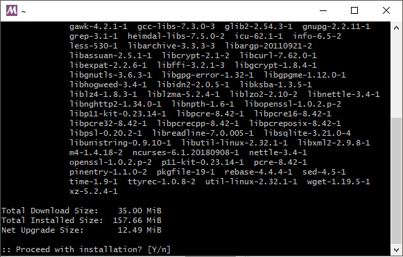

##### Now we need to install a DNS resolver
```
pacman -S mingw-w64-x86_64-unbound
```
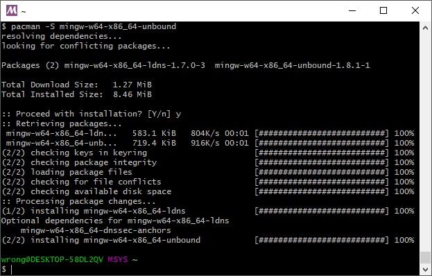

##### Now we install “git”
```
pacman -S git
```
This will install software that will communicate with github to pull
copies of a project.

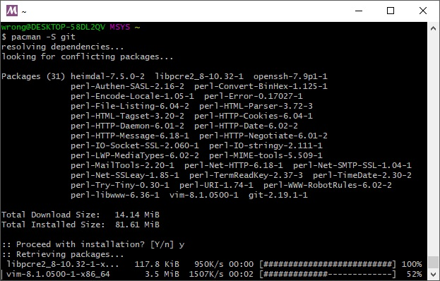

Exit out of msys

Please browse back to the C:\msys64 and look for mingw

#### Run mingw
```
git clone --recurse-submodules https://github.com/graft-project/GraftNetwork.git
```
or for the community edition
```
git clone --recurse-submodules https://github.com/graft-community/GraftNetwork.git
```
Once its done type (this will put you in the current directory of
GraftNetwork)

`cd GraftNetwork`

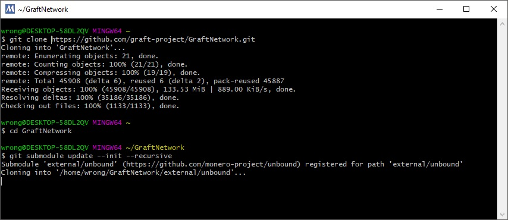

Type
```
make release-static-win64
```
It should compile the static executables to
`C:/msys64/GraftNetwork/build/release/bin`

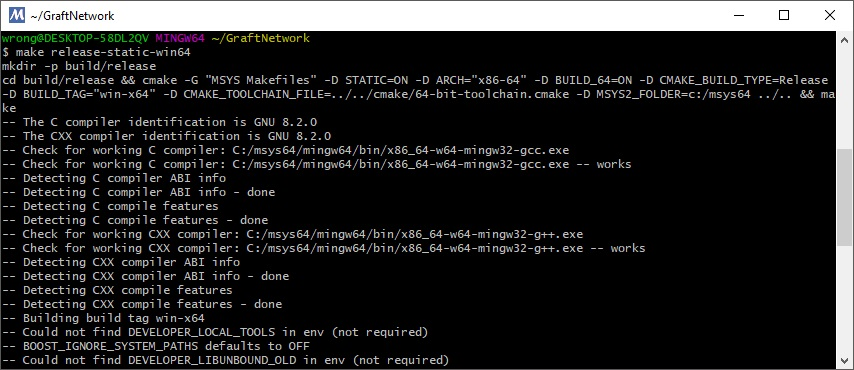

If you need assistance feel free to contact me in telegram.

`@SomethingGettingWrong`


