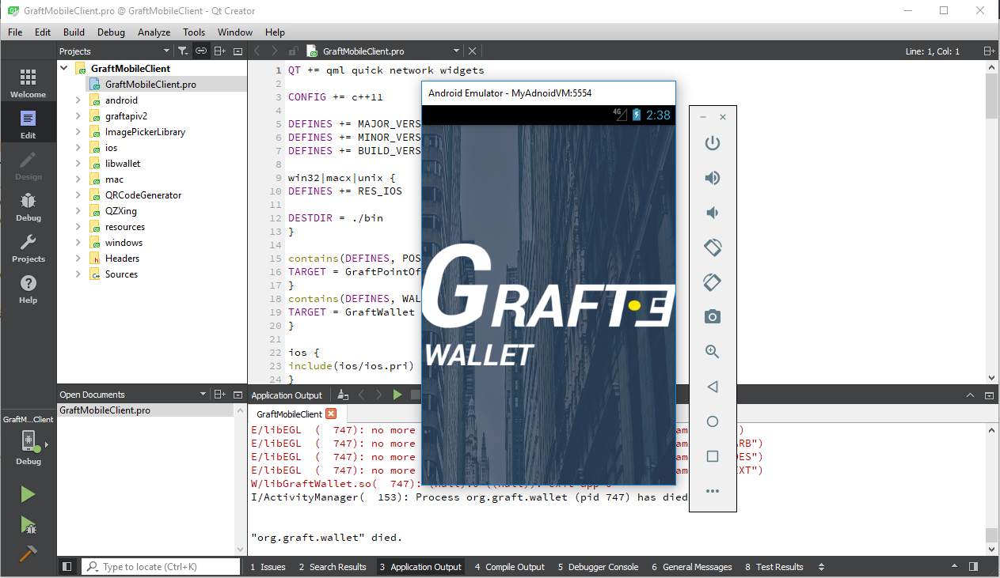

# Instructions on how to build Graft Android Wallet and POS on Qt cross-platform application framework for Windows desktop.





### Preamble

### What is Qt?

Qt is a cross-platform application development framework for desktop, embedded and mobile. Supported Platforms include Linux, OS X, Windows, VxWorks, QNX, Android, iOS, BlackBerry, Sailfish OS and others.

Qt is not a programming language on its own. It is a framework written in C++. A preprocessor, the MOC (Meta-Object Compiler), is used to extend the C++ language with features like signals and slots. Before the compilation step, the MOC parses the source files written in Qt-extended C++ and generates standard compliant C++ sources from them. Thus the framework itself and applications/libraries using it can be compiled by any standard compliant C++ compiler like Clang, GCC, ICC, MinGW and MSVC.

### Why Qt for GraftWallet?

GraftWallet and POS were developed using the Qt Cross Platform IDE. In order to build Graft Wallet and/or POS from Graft's Qt Team's GitHub or GitLab repositories it requires installing the Qt develoment environment which further requires the installation of Java SDK, Android SDK, Android NDK and an image for Android to emulate it for testing. The versions of these indicated here are accepted as being least problematic at the time of this writing even though some are not the very latest version. They are also versions which reflect the current build on PlayStore for Android Version 4.1 Jelly Bean. The one kit of main concern presently is the Android NDK version. Further consultation with Qt user groups would be best source to ascertain which modules are presently most compatible with Qt and potentially updated. The examples here were simply the ones I utilized and worked.

## GraftWallet Resources

Graft Wallet presently post their latest open source projects in these two locations for reference:

```https://github.com/graft-project/GraftMobile```

additionally on GitLab here:

```https://git.vakoms.com/qt-team/graft-mobile-client```

If you intend to contribute changes to the project the official community repository to fork and commit changes to is located here:

```https://github.com/graft-community```

## Required Platform Downloads

An unzip tool and a torrent client. Virtually any will do. Required to obtain and extract the files intially.

Download Qt offline installer via torrent (utorrent etc.). It's legit just happened to be the fastest download from my experience.

```http://download.qt.io/archive/qt/5.11/5.11.2/qt-opensource-windows-x86-5.11.2.exe.torrent```

Download JDK Kit8U191 for Windows x64

```https://www.oracle.com/technetwork/java/javase/downloads/jdk8-downloads-2133151.html```

Download Android NDK ver r17c

```https://dl.google.com/android/repository/android-ndk-r17c-windows-x86_64.zip```

Download Android Developer Studio

```https://developer.android.com/studio/```


## Java Development Kit Install

Install JDK 8 (default settings and location)


## Qt Main Application Install

Run Qt installer you brought down by torrent -> qt-opensource-windows-x86-5.11.2

Create a Qt account. (this is under their open source GPL)

Add Android ARMv7 to components already pre-selected, agree to licenses, install,
Windows UAC will likely pop up for Qt install allow.


## Android Native Development Kit Extraction

Extract Android NDK to a new folder i.e.

```C:\QtForAndroid\android-ndk-r17c-windows-x86_64```

We are going to use r17c although it's not the latest due to reported issues with the latest in Qt.


## Install Android Studio

Run the installer and select defaults. At Finish screen run application. Selection -> Do not import settings.
Add Android Virtual Device to selections. Wait for components to download


## Install Android SDK

Within Android Studio select Configure. Choose a path for the SDK to be located. Ensure the path you choose to this location contains no spaces.

Example. Using ```C:\AndroidSDK``` is ok. Using ```C:\Android SDK``` is not due to the blank space.

Open SDK Manager. SDK Platform -> Select Android 4.1 Jelly Bean. SDK Tools -> Select all except NDK. Apply. Close when finished.
Android SDK versions and images will be added and handled within Qt from here on in.


## Set up Qt Environment

Open Qt Creator

Go to Tools -> Options. Select Devices from left panel

Click on Android tab

JDK location should already be populated with it's location using the version stated here this should be.

```C:\Program Files\Java\jdk1.8.0_191```

Android SDK location browse to i.e ```C:\AndroidSDK``` if you used the location in the earlier example.

Android NDK location you can browse to it's location which is this location if you used the example.

```C:\QtForAndroid\android-ndk-r17c-windows-x86_64\android-ndk-r17c```

Click on SDK Manager tab. Make sure Show Packages All is selected. Drop down Android 4.1 4.1.1. Install Andriod SDK and ARM EABI v7a System Image. Click the Apply button. Agree to the licences. This requires several times accepting until you see it being to download. There's literally a progress bar for the number of acceptances plus another progress bar will start for the download.
(Images are required to run the AVD emulator.).

Click on AVD Manager tab. Fill in -> Name: ```MyAndroidVM```, ABI: ```areabi-v7a```, Target API: ```android-16```, SD card size: ```1000```

Wait while it creates the Android 4.1 Jelly Bean AVD instance for emulation.

Click Start... to test the emulator. Ignore the error messages for now. You can close it. It will automatically prompt for reopen when you run.

You have now configured Qt, with Android SDK 4.1, Android NDK, Java SDK and created a emulator AVD for Android Jelly Bean 4.1.

## Downloading and organizing GraftMobile project files for use.

Download GraftMobile version you want to build from github. The project requires the three submodules; QXZingBInaries, QR-Code-Generator and LibWallet to be included. The following is how to down load and unzip them manually.

```https://github.com/graft-project/GraftMobile```

download QZXingBinaries from github.

```https://github.com/EDDragonWolf/QZXingBinaries/tree/725926f3d6ec5ce5cd50313999e1aed2ba6bc724```

download QR-Code-generator from github.

```https://github.com/EDDragonWolf/QR-Code-generator/tree/d388c31e9589874a538264e5c34bd79770f85b9b```

download submodule exlibwallet from GitLab; zip version for simplicity.

```https://gitlab.com/EDDragonWolf/explibwallet```

Extract ```GraftMobile-<version>``` to a folder you are going to open the project. From example given it would be.

```C:\QtProjects``` (make sure there are no spaces included in the name of whatever you name it)

Note: Depending on the verion you are building the zip file will be ```GraftMobile-<version>``` where version is the one you downloaded. Example ```GraftMobile-development```.

When unzipping the following you just want the contents of each of these folders extracted into it's respective exitsting folder within the GraftMobileClient directory tree. Do not replicate the folder iself which is included in the zip file within the existing GraftMobileClient folder. 

Extract QZXingBinaries contents in the ```GraftMobile-<version>``` directory in the existing qzxing empty folder.

Extract QR-Code-generator contents in the ```GraftMobile-<version>``` directory in the existing qrcodegenertor empty folder.

Extract exlibwallet contents in the ```GraftMobile-<version>``` directory in the existing libwallet empty folder.

In all instances the ```<version>``` is substituted with the name of whatever you downloaded ```master```, ```development```, etc.


## Building In Qt

Start Qt

File -> Open File or Project. Navigate to the ```GraftMobileClient.pro``` file and open it.

Note Qt .pro files contain information regarding building in the Qt enviroment.
When loading the project you simply need to load the associated .pro file the associated project files will be loaded automatically.

Click on Projects on the left. 

Under Build Steps qmake details -> Additional arguments: ```DEFINES+=WALLET_BUILD```.

Note: ```DEFINES+=WALLET_BUILD``` instructs Qt to build the wallet. For POS use the argument ```DEFINES+=POS_BUILD``` instead.

Under Build Settings click on Build Android APK Details and select Android build SDK: android-16. 
By selecting android 16 you are building for Android 4.1 Jelly Bean the current minimum stated requirement in Google PlayStore.

Now you can run and/or simply compile. By running you will be a debug version and will be prompted for the AVD to run it in. 
Select it and the project will begin compilation and be sent to the AVD once complete.
On the bottom you can select tabs to monitor processes such as "Compile Output".


 


