# **Graft Supernode Mainnet - Simple step-by-step Supernode setup instructions for non-Linux users**
a.k.a - Graft: Running a Supernode for Dummies Guide


- GraftNetwork - v1.7.5 
- Supernode v1.0.4

---
_by: yidakee (aka el_duderino_007)_

## General considerations

* This release is for main net launch. 

* This is a bare minimum install recommended for linux newbies and troubleshooting purposes.

* This guide is not intended for linux educational purposes, rather a simple copy/paste procedure to get your Supernode up an running (safely) and see it working properly and learn basic Supernode management, to later be able to follow more advanced setup guides.

* In future guide, I'll explain how to set up a Supernode with basic security issues addressed, basic hardening and setting the Supernode as a service so it survives a spontaneous reboot/crash.

* Some screenshots show previous versions - be sure to use the correct version as of THIS guide - `Graft Network 1.7.5` + `graft-ng 1.0.4

## Requirements

* Any modern machine with at least 2GB per core, 2GB RAM recommended - some reports show it will work with 1CPU and 1GB RAM
* Current bandwidgth consuption ~300GB - 600GB per month
* VPS (_virtual private server_) recommended.

## Brief list of VPS poviders - 


| URL                          | Specs     | Bandwidth | Storage| Price/month     |
| -------------                |:---------:| :--------:| :-----:| :--------------:|
| https://vultr.com            | 2vCPU 4GB | 3 TB      | 60GB   |    $20          |
| https://digitalocean.com     | 2vCPU 4GB | 4 TB      | 80GB   | $100 Free Trial |
| https://www.hetzner.com/     | 2vCPU 4GB | 20TB      | 40GB   |    4,90€        |
| https://contabo.com/         | 4 CPU 8GB | Unlimited | 200 GB |    4,99€        |
| https://www.linode.com/      | 2vCPU 4GB | 4TB       | 80GB   |    $20          |
| https://www.ovh.com/         | 2vCPU 7GB | ?         | 50GB   |    $26.40       |

* Link to Digital Ocean free $100 Trial (must provide Credit Card) - https://try.digitalocean.com/performance/

* Start by selecting a VPS provider, spin up a node selecting Ubuntu 18.04.

* Once you’ve fired up your node, `ssh` into the server and perform typical maintenance


````bash
    sudo apt-get update
````
````bash
    sudo apt-get upgrade
````


* If this window shows up, select the first option


* We will now download the latest Graft release, and then the Supernode release

````bash
    wget https://github.com/graft-project/GraftNetwork/releases/download/v1.7.5/GraftNetwork_1.7.5-ubuntu-18.04-x64.tar.gz
    wget https://github.com/graft-project/graft-ng/releases/download/v1.0.4/supernode.1.0.4.ubuntu-18.04.x64.tar.gz
````

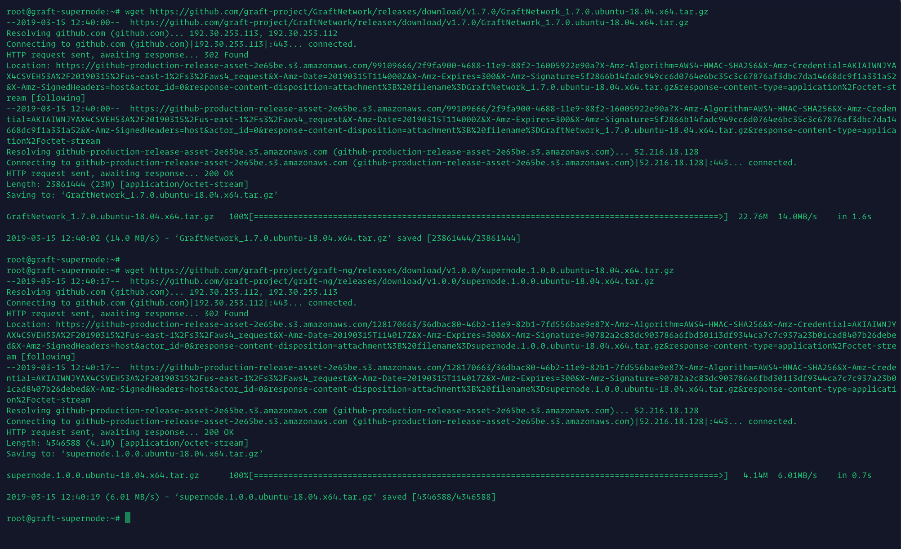


* Lets have a look at the downloaded file. The compressed files show up in red

````bash
    ls -la
````


* Now, let's decompress the files and view the directories - these show up in blue

````bash
    tar -zxvf GraftNetwork_1.7.5-ubuntu-18.04-x64.tar.gz
    tar -zvxf supernode.1.0.4.ubuntu-18.04.x64.tar.gz
    ls -la
````

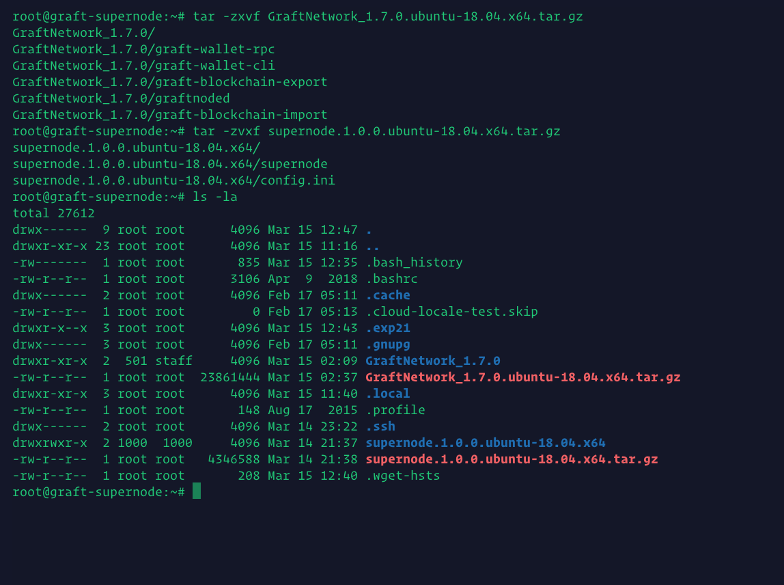

* Next, lets enter the directory where the GraftNetwork binaries where decompressed into, and have a look inside. You will see there is a `graft-supernode` binary inside - do not use this one! The actual Supernode binary is inside /root/supernode.1.0.4.ubuntu-18.04.x64/

````bash
    cd GraftNetwork_1.7.5
````
````bash
    ls -la
````

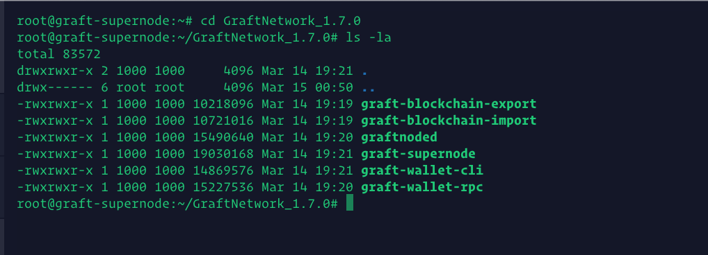

* To go back, simply issue `cd` command, and you'll be back to the main /root/ directory. 

````bash
    cd
````

Here is a handy Linux trick. Instead of writing `cd supernode.1.0.4.ubuntu-18.04.x64` try just typing `cd supe`and then press Tab. Linux is smart enough to guess what you mean and will autocomplete for you ;) 

### Great! We’ve managed to install everything.

You now have;

* `graftnonded` - syncs the blockchain, has interactive commands
* `graft-wallet-cli` - wallet management, has interactive commands
* `supernode` - RTA/supernode functions, non-interactive

These will be the only binaries you will use, do not use the others.

* We could run `graftnoded` and sync from scratch, but who wants to wait 5h doing nothing? Lets "cheat" by directly downloading the blockchain ans save lots of time.

* Let's run `graftnoded` and wait a little for it to build the directories - give it 1 minute and then `exit` to stop `graftnode`

````bash
    cd GraftNetwork_1.7.5
    ./graftnoded 
````
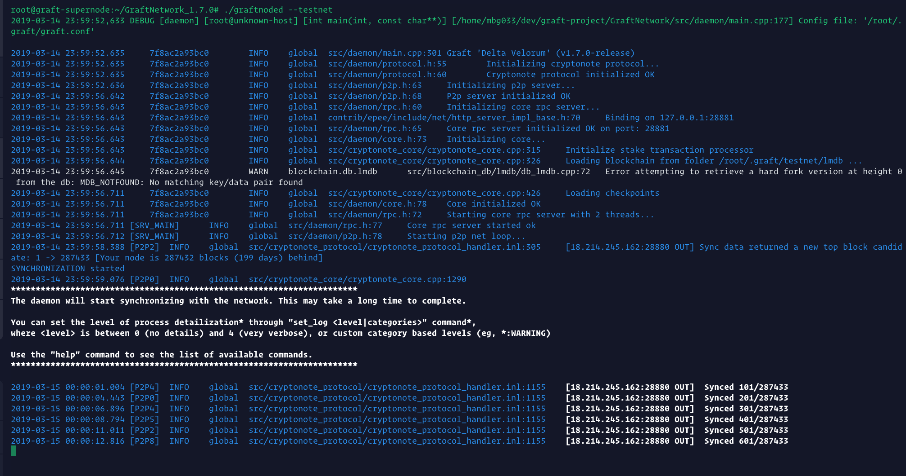

* A soon you see the bottom lines saying `Synced xxx/xxxxxx` , you can type `exit` to quit `graftnoded`

* Let's navigate to the directory where the blockchain lives in, delete the current one and download the most current up-to-date. The screenshot shows `testnet` and steps are slightly different, but behaviour is identical

````bash
    cd $HOME/.graft/
    ls -la
    rm -r lmdb
    curl http://graftbuilds-ohio.s3.amazonaws.com/lmdb.tar.gz | tar xzf -
    cd lmdb && rm em* && rm lo*
    cd
````
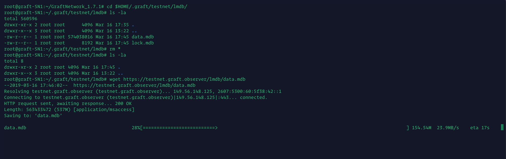

* Big shoutout to _jagerman_ for keeping a publicly available copy of the blockchain. Thanks man, you rock!

* Alternatively, you can use this torrent -> [Torrent](easy-guide-mainnet/Graft.mainnet.data.mdb.torrent) - Thanks @MV1879!


* Brilliant! Now lets go back and start `graftnoded` again, and be almost immediately up to block height.

````bash
    cd 
    cd GraftNetwork_1.7.5
    ./graftnoded 
````

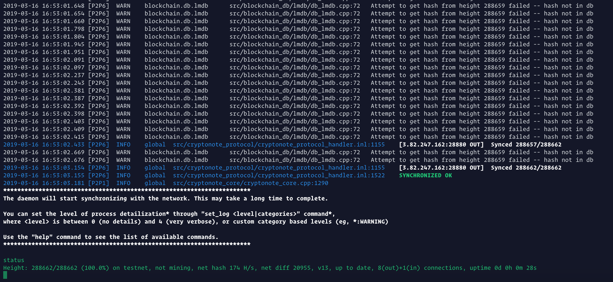


* Type `help` and press `Enter` to see the list of commands you can run to inspect the network. Enter `status` to double check your block height against the block explorer ->  https://graft.observer

Supernodes run on cold wallet staking, so you should NOT keep your stake wallet on a live server. Especially with this barebone insecure server setup.

### Next -> create a wallet for the Supernode stake

* I will never use this wallet, so I'm ok with sharing the address and the mnemonic seed for the sake of the tutorial. Don't ever use this wallet address or mnemonic seed word list for yourself, as you're more than likely to lose any funds sent to it. Please keep your real mnemonic seed secret to only yourself at all times, never share it, never lose it!

* Ideally, you should do this on a local and secure machine. If you absolutely need to, you _can_ use the VPS, but after using the wallet dont forget to delete it. Keep your mnemonic seed in a very safe place in case you need to restore it in the future.

* Open a new Terminal window, and fire up the `graft-wallet-cli` to generate a new wallet. Follow the instructions, and you will receive a wallet address and the 25 word mnemonic seed. Do not lose the seed! 

* Oh !!! I _almost_ forgot... never, _ever_, lose your wallet seed !!

````bash
    cd 
    cd GraftNetwork_1.7.5
    ./graft-wallet-cli 
````

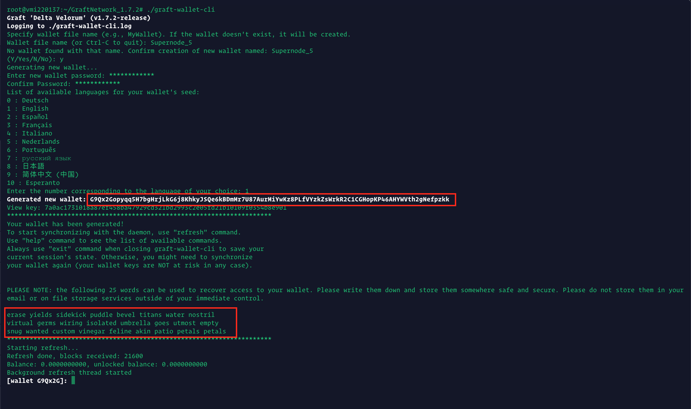


* Copy the wallet address to somewhere handy, you will need it a a bit to configure the supernode.


### Now, let's start the Supernode

* **You will need to start a new Terminal session** - if you close the current terminal window, it will kill the current process, in this case `graftnoded` - in future tutorials we will explain how to use `screen` to solve this, but for now we're keeping it simple.

* So, open a new Terminal session, `ssh` into your VPS, and enter the Supernode directory 

````bash
    cd supernode.1.0.4.ubuntu-18.04.x64
    ls -la
````
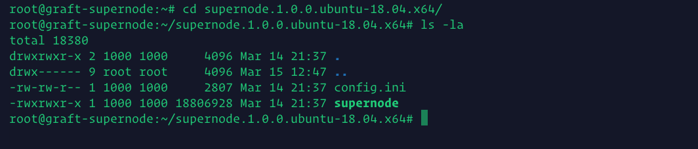

* We need to edit the `config.ini` file to add in your stake wallet address - so have that handy! We will use `nano`, one of many linux text editors. Once inside the file, use your arrow key to navigate to `wallet-public-address=` and paste in your Supernode stake wallet address we generated earlier. Remember, this is a real mainnet, not a testnet tutorial, so please make sure the address starts with an `G` 

````bash
    nano config.ini
````
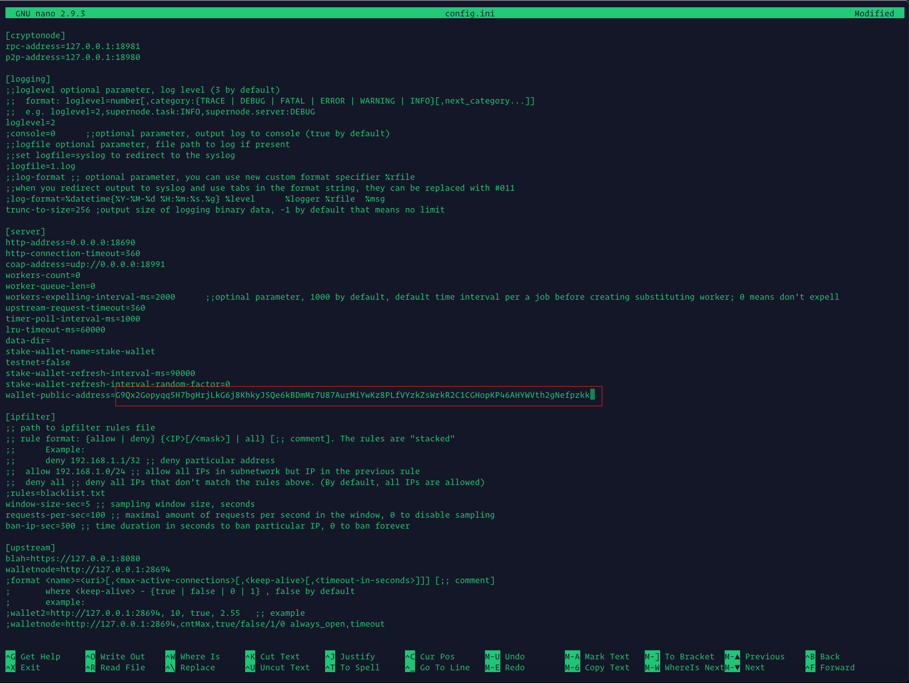


* To save the file, look at the bottom row of the screen and press `CTRL+x` on your keyboard. It should now say `Save modified buffer?` - simply type `y` and press enter.


* Let's start the Supernode. Before we do so, lets quickly do a patch fix that should not be required in the future.

````bash
    sudo apt install libboost-all-dev
````


* Start the Supernode to get it running without stake for now, to grab some final info.

````bash
    ./supernode
````


* If you check back on `graftnoded` Terminal, you should start seeing the Supernode announcements to the network


Now literally take a 15 minute break. No, seriously, take 15 minutes to stretch your legs, make some coffee, feed your pets, water your plants etc ...  and let the Supernode start talking to its peers and collect some data for the next part. Even is your Supernode is not staked yet to receive RTA ts fees, it is still working as a proxy node.

* After 15m, let's check out your Supernoode outputs. Two ways to verify if your Supernode is healthy is by checking it's peer list and ID info.

* First, lets check if the Supernode list is working right. Be sure to input your Supernode IP in the follwoing command, as per the screenshot. Don't forget the to substitute `Your_Server_IP` with your actual server IP.

* Open a new Terminal window! If you close the Terminal window running the Supernode, you will kill the process.

````bash
    curl --request GET http://Your_Server_IP:28690/debug/supernode_list/1
````


* It looks kind of weird, but that output is a positive sign. You can also use a browser to see the same output using `http://Your_Server_IP:28690/debug/supernode_list/1` - You won't be needing this, but is one way to check if your Supernode is working properly.

* Next, let's check the Supernode for the info we need to activate it on the network. Issue the following command, but substitute `Your_Server_IP` with your actual server IP. You will see the wallet address you previously configure in `config.ini` along with an ID_Key and Signature. We will need these in a bit to stake the Supernode to activate it and start earning rewards.

````bash
    curl --request GET http://Your_Server_IP:28690/dapi/v2.0/cryptonode/getwalletaddress
````
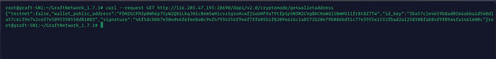

You can also use a browser to get this info. Just use the url `http://Your_Server_IP:28690/dapi/v2.0/cryptonode/getwalletaddress`.
It may be easier to visualize and copy/paste for the next part - funding the stake wallet!


* Send the amount you wish to stake to the Supernode stake wallet created earlier, the one in `config.ini` .

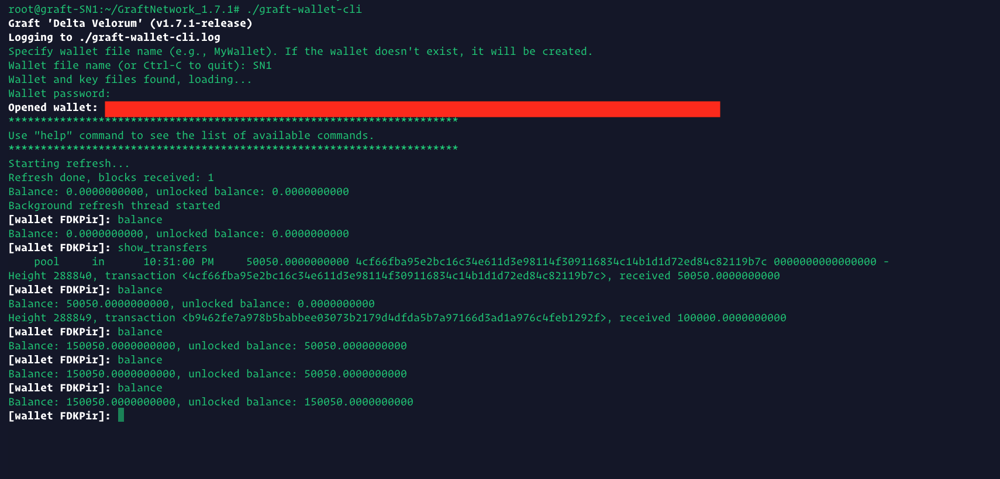

* Once the coins have been unlocked, you can issue the staking command. The syntax is pretty simple.

* `stake_transfer <SUPERNODE_WALLET_PULIC_ADDRESS> <STAKE_AMOUNT> <LOCK_BLOCKS_COUNT> <SUPERNODE_PUBLIC_ID_KEY> <SUPERNODE_SIGNATURE>`

* Looks intimidating, but it's pretty simple. Remember a few steps back when you requested the `Supernode ID_KEY` and `Signature` ?

* To remind you, just pop this into your browser. Don't forget to change `Your_Server_IP` for your actual server IP

`http://Your_Server_IP:28690/dapi/v2.0/cryptonode/getwalletaddress`

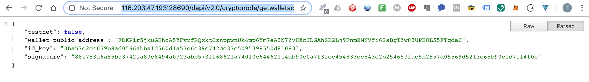


* So now, go to your wallet and lets complete the `stake_transfer` command, In this case, I will be setting up a Tier 3 node. The ammounts does not need to be exact. Select the number of blocks you want to stake for. 720 blocks is just about 24h. Minimum 50, maximum is 5000 blocks = 1 week


* Now, just wait 6 blocks for the transfer to go through and your Supernode will have been activated!

* You can regularly check on your Supernode using this URL `http://YOUR_IP:28690/debug/supernode_list/1`  


### Congratulations! You've managed to get your Supernode up and running.

* Give yourself a pat on the back!

* Now, just sit back and relax. Soon enough you will start earning Supernode rewards!

* Don't forget to join us in the Supernode channels on Discord (https://discord.gg/xsr8M3) or Telegram (https://t.me/GraftSuperNode) to get the most up to date news!

* yidakee out 


