# **Graft Supernodes - All of them**
## *Simple step-by-step 'Dummies' guide for running multiple Supernodes*
a.k.a - Graft: Running more than one Supernode on a single server for Dummies Guide

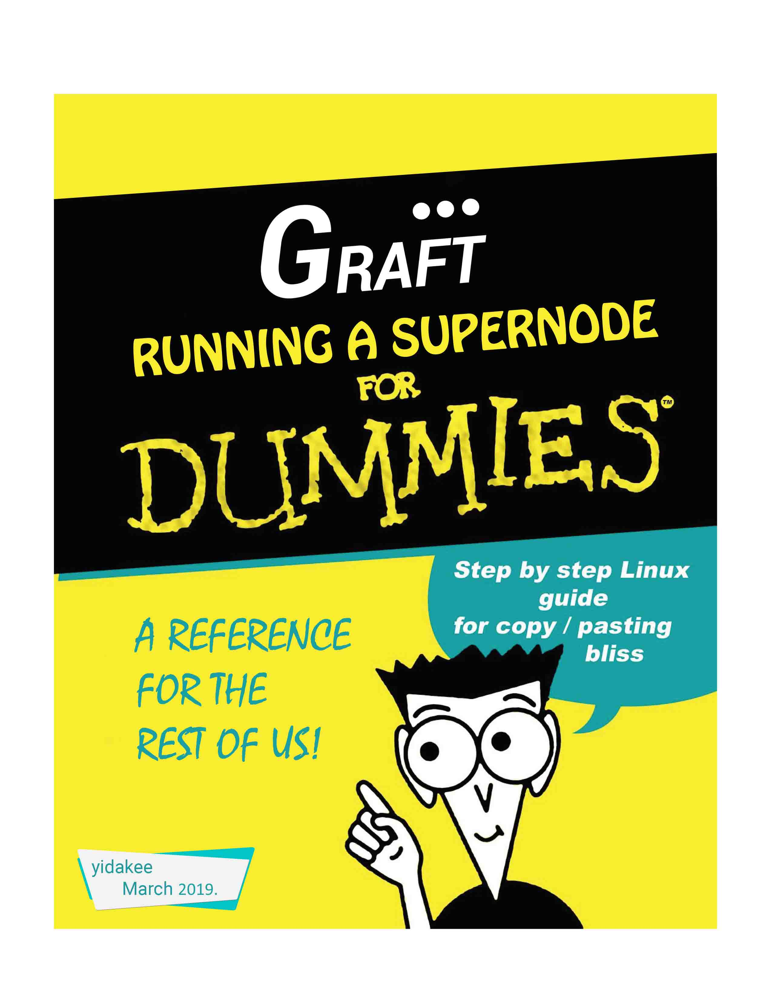

- GraftNetwork - v1.7.1
- Supernode v1.0.0

---
_by: GraftNugget (forked from yidakee [aka el_duderino_007])_
Note: This guide is intended to get you to a point of running multiple supernodes on the one server. The steps required to stake them do not change from yidakee's guide.


## General considerations
* Currently, the functionality of running multiple Supernodes against one instance of graftnoded requires the use of the [Graft Community] (https://github.com/graft-community) code, this guide will get you running on this code base.

* This release is in preparation for main net launch. It will run on Public Testnet. This is different from the previous RTA Alpha testnet. If you have wallets with funds from the RTA Alpha testnet, these will not show up on Public Testnet.

* DO NOT use GraftNetwork v1.7.0 (even though some screenshots here show v1.7.0, this version had a bug that has since been patched)

* Instructions for Graft _Official Release v1.7.1 Public Testnet_ - this is not the same tesnet as previous _RTA Alpha 5.1_

* This is a bare minimum install recommended for linux newbies and troubleshooting purposes.

* This setup is **only for Testnet** - should be almost identical to main net, but I cannot predict the future. Upon main net launch, this guide will be revised/updated

* This guide is not intended for linux educational purposes, rather a simple copy/paste procedure to get your Supernode up an running and see it working properly and learn basic Supernode management, and later be able to follow more advanced setup guides.

* Things may not look _exactly_ the same on your system as the screenshots included in this document. For example, this guide is for v1.7.1, but some screenshots show 1.7.0 - simply copy/paste the commands and you should be good.

## Requirements

* Any modern machine with at least 2GB per core, 2GB RAM - Note: The more SN's you want to run, the bigger the machine.
To give context - I personally run a 32gb 4 Core Server [E3-SSD-1-32] (https://www.soyoustart.com/us/offers/1801sys47.xml) which I have tested to 10+ Graft Supernodes.

* Current bandwidgth consuption ~500GB - 1TB per month
* VPS (_virtual private server_) recommended.

## Brief list of VPS poviders


| URL                          | Specs     | Bandwidth | Storage| Price/month     |
| -------------                |:---------:| :--------:| :-----:| :--------------:|
| https://vultr.com            | 2vCPU 4GB | 3 TB      | 60GB   |    $20          |
| https://try.digitalocean.com | 2vCPU 4GB | 4 TB      | 80GB   | $100 Free Trial |
| https://www.hetzner.com/     | 2vCPU 4GB | 20TB      | 40TB   |    4,90€        |
| https://contabo.com/         | 4 CPU 8GB | Unlimited | 200 GB |    4,99€        |
| https://www.linode.com/      | 2vCPU 4GB | 4TB       | 80GB   |    $20          |
| https://www.ovh.com/         | 2vCPU 7GB | ?         | 50GB   |    $26.40       |

* Link to Digital Ocean free $100 Trial (must provide Credit Card) - https://try.digitalocean.com/performance/

* Start by selecting a VPS provider, spin up a node selecting Ubuntu 18.04.

* Once you’ve fired up your node, `ssh` into the server and perform typical maintenance


````bash
    sudo apt-get update

````
````bash
    sudo apt-get upgrade

````
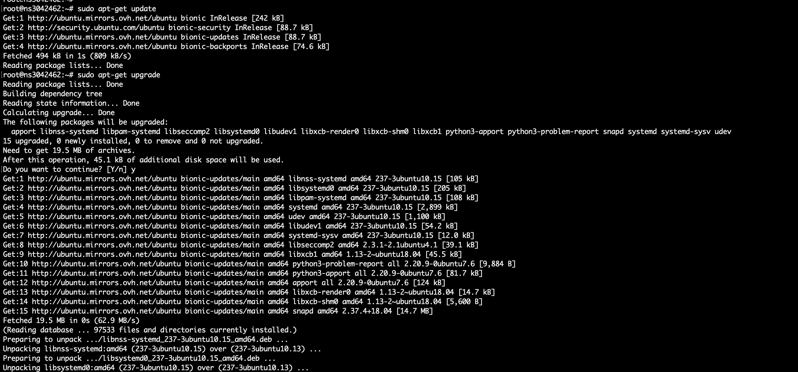

* If this window shows up, select the first option

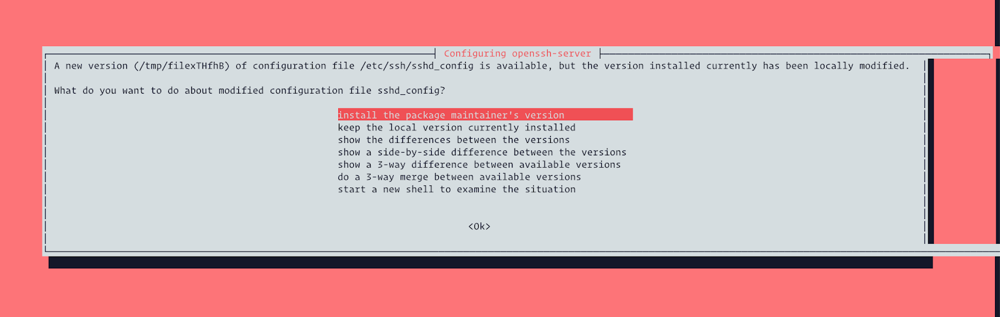


* We will now configure the [repository] (https://deb.graft.community) and install the binaries - this means easy updates in the future.

````bash
    curl -s https://deb.graft.community/public.gpg | sudo apt-key add -
````
````bash
    echo "deb https://deb.graft.community bionic main" | sudo tee /etc/apt/sources.list.d/graft.community.list
````
````bash
    sudo apt update
````

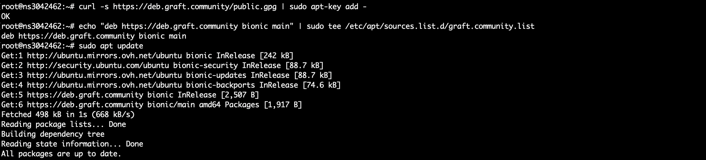

* Installing graftnoded
````bash
    sudo apt install -y graftnoded
````

* Installing graft-supernode
````bash
    sudo apt install -y graft-supernode
````

* Installing graft-wallet-cli
````bash
    sudo apt install -y graft-wallet
````

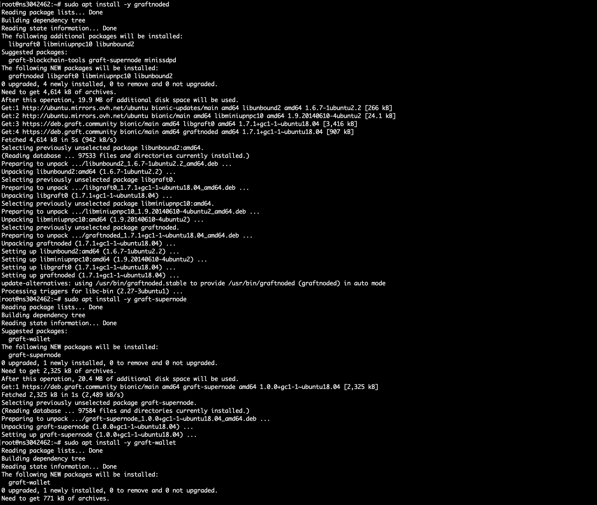

* Lets have a look at the binaries that have been deployed, make sure they are in your PATH and executable.

````bash
    which graftnoded
    which graft-supernode
    which graft-wallet-cli
    graftnoded --version
    graft-wallet-cli --version
    graft-supernode --version
````


### Great! We’ve managed to install everything.

You now have;

* `graftnonded` - syncs the blockchain, has interactive commands
* `graft-wallet-cli` - wallet management, has interactive commands
* `graft-supernode` - RTA/supernode functions, non-interactive

These will be the only binaries you will need.

* We could run `graftnoded` and sync from scratch, but who wants to wait 5h doing nothing? Lets "cheat" by directly downloading the blockchain ans save lots of time.

* Lets run `graftnoded` and wait a little for it to build the directories - give it 1 minute and then `exit` to stop `graftnode`

````bash
    graftnoded --testnet
````

* Leave it for 15 or so seconds and exit , you can type `exit` to quit `graftnoded`

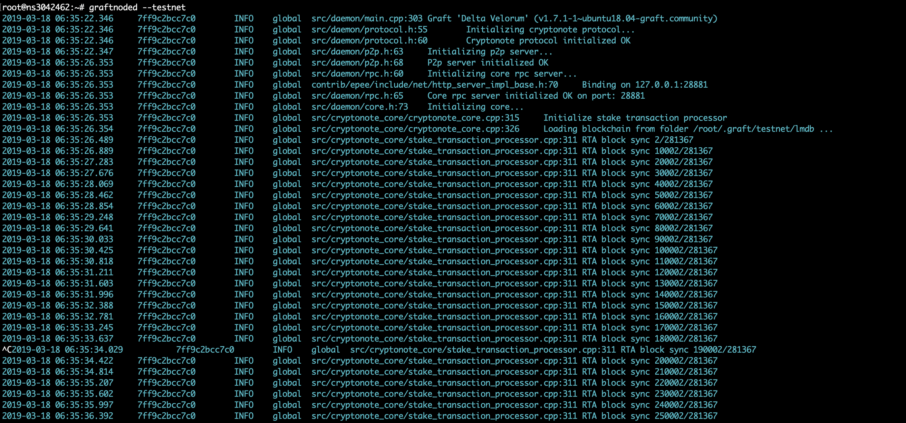

* Let's navigate to the directory where the blockchain lives in, delete the current one and download the most current up-to-date.

````bash
    cd $HOME/.graft/testnet/lmdb/
    ls -la
    rm *
    ls -la
    wget https://testnet.graft.observer/lmdb/data.mdb
````

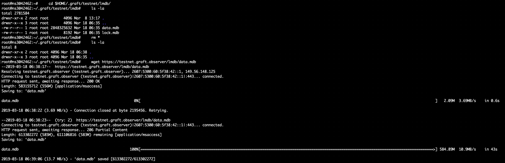

* Big shoutout to _jagerman_ for keeping a publicly available copy of the testnet blockchain. Thanks man, you rock!


* Brilliant! Now lets go back and start `graftnoded` again, and be almost immediately up to block height.

````bash
    graftnoded --testnet
````

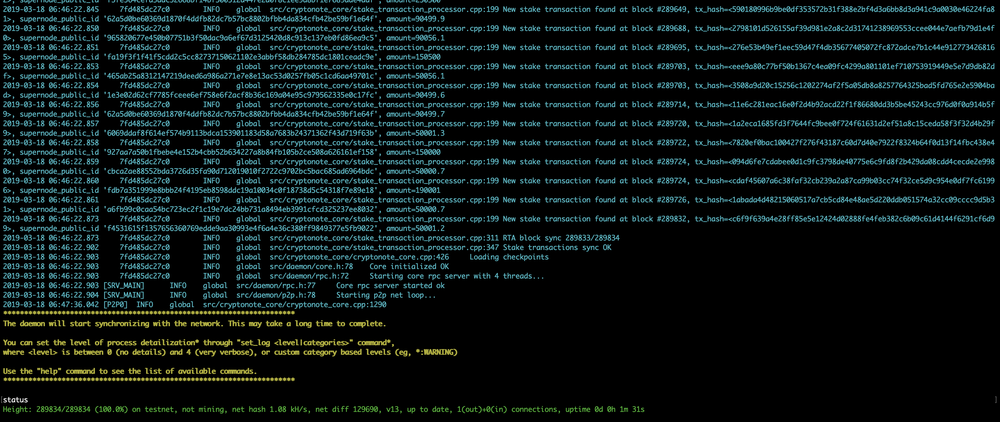

* Type `help` and press `Enter` to see the list of commands you can run to inspect the network. Enter `status` to double check your block height against the block explorer -> http://testnet.graft.network or jagerman's https://testnet.graft.observer

When you’re up to block height, then you can safely run wallets, any wallet. Supernodes run on cold wallet staking, so you should NOT keep your stake wallet on a live server. Especially with this barebone server setup.

* Right! Now we have our node up and communicating to the network/blockchain, we need to create "Homes" for each of our Supernode instances.
* For the sake of this tutorial, we will run 2 Supernodes. If you want to run more than 2, just follow the below steps multiple times and crate SN3 SN4....

* **You will need to start a new Terminal session** - if you close the current terminal window, it will kill the current process, in this case `graftnoded` - in future tutorials we will explain how to use `screen` to solve this, but for now we're keeping it simple.

* So, open a new Terminal session, `ssh` into your VPS - you will now be in your HOME directory.

* Lets create SNx - this will be the template for creating as many Supernodes as your bank ballance allows.
````bash
    mkdir -p SNx
````
Now lets add the required config.ini
````bash
    cd SNx
    cp /usr/share/doc/graft-supernode/config.ini . 
````
and add the graft-supernode binary to SNx
````bash
    cp /usr/bin/graft-supernode .
````

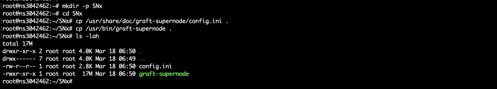

* We need to edit the `config.ini` file to add in your stake wallet address - so have that handy! We will use `vim`, one of many linux text editors. 
* The items of interest for this step are boxed in red
* You will need to set the port [28881 for Public Testnet] as highlighted and also the Data directory - Leave the address blank as we wil configure that per SN in the steps below.

````bash
    vim config.ini
````
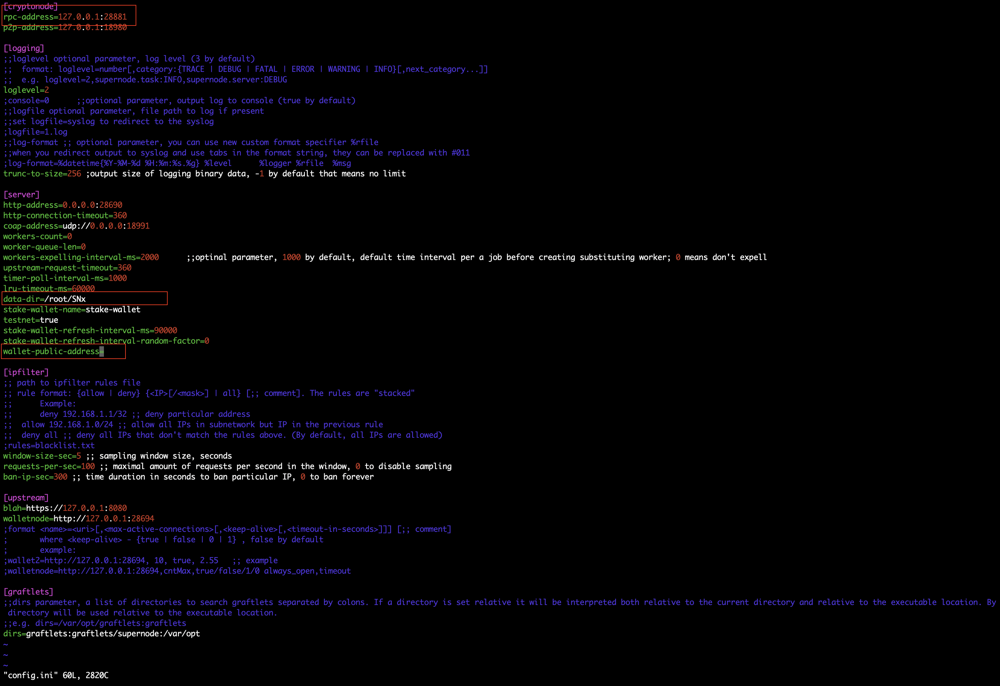

*note: to put vim into edit mode, press i - to save and exit press ESC and then :wq!


* Alrighty, so now we have a working template (SNx) that can copied into as many instances of Supernode that you wish to run (SN1 SN2 SN3 ....)
* For this demo, we will be running a SN1 and a SN2

````bash
    cd ~
    cp -R SNx SN1
    cp -R SNx SN2
````
* You now have your stand alone instances SN1 and SN2 - what we need to do now is configure the Data directory and wallet address in each of the respective config.ini

````bash
    cd SN1
    vim config.ini
````
* update the data-dir to reflect the home of SN1 along with the stake wallet address.

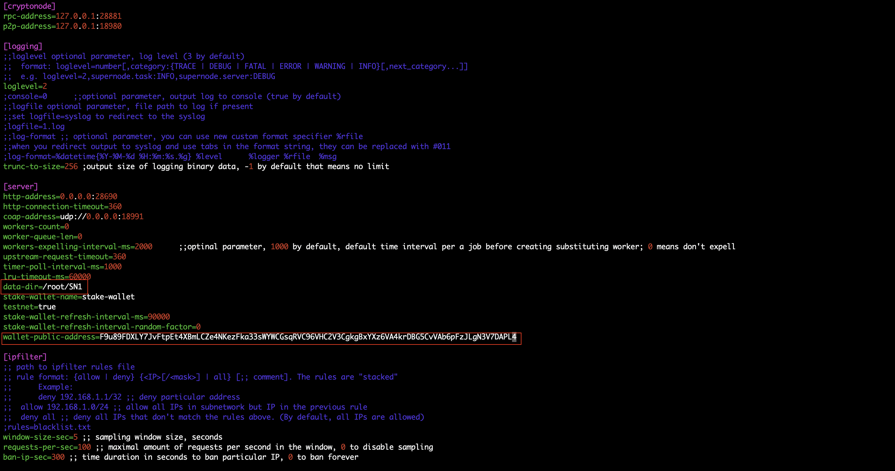

* Ok, so now we have SN1 configured, we need to make the changes to SN2's config.ini - pretty much like SN1 but we incriment 2 port numbers.


````bash
    cd ../SN2
    vim config.ini
````
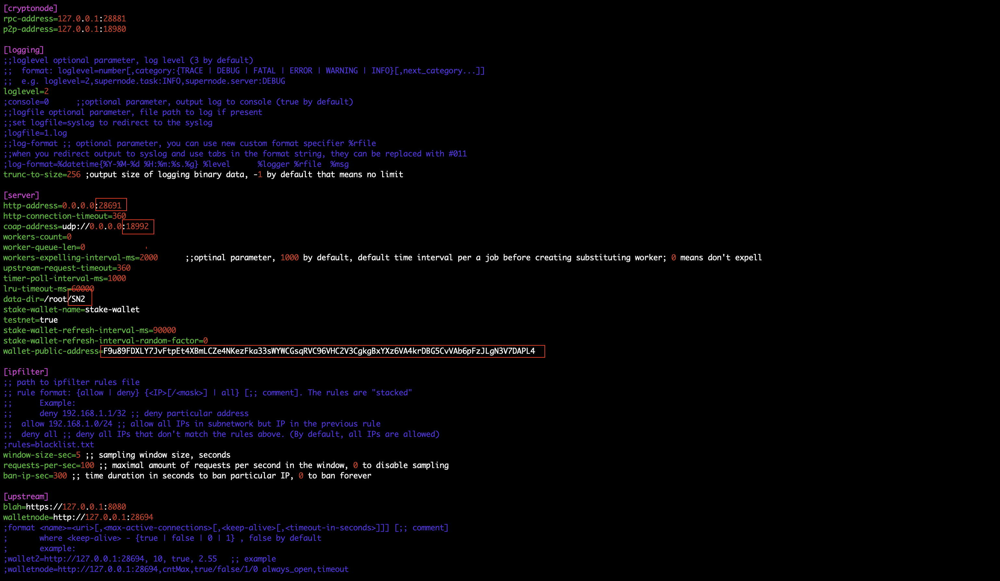

* You con continue the above step as many times as you want, each time incrimenting the http-address and coap-address ports.

* You now have 2 supernodes configured ready to fire up - if you know how to use screen, do that other wise create 2 new ssh sessions and start graft-supernode for both SN1 and SN2


````bash
    cd SN1
    ./graft-supernode
````

````bash
    cd SN3
    ./graft-supernode
````

* One final step we need to now do is confirm that the SN's are up and running, you can do this by calling a function of each of them to display the paremters of each SN - you will need this infomation for the staking process; take note and record the output.

````bash
    curl -s http://127.0.0.1:28690/dapi/v2.0/cryptonode/getwalletaddress
    curl -s http://127.0.0.1:28691/dapi/v2.0/cryptonode/getwalletaddress
````

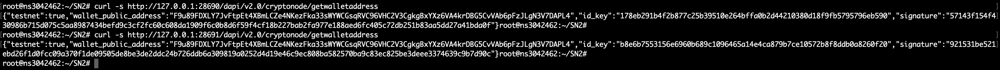


* IMPORTANT - FROM THIS POINT onwards, please refer back to yidakee's guide which takes you through how to stake the supernodes etc.

