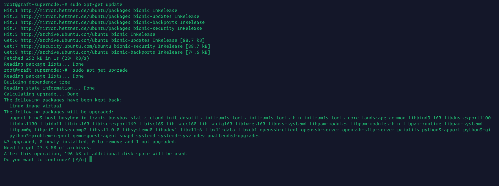
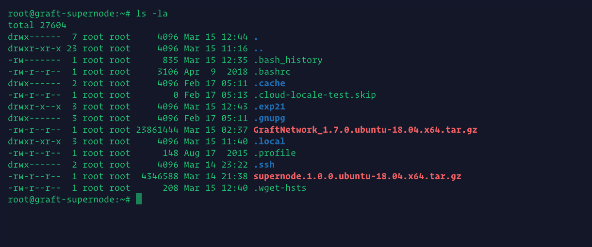
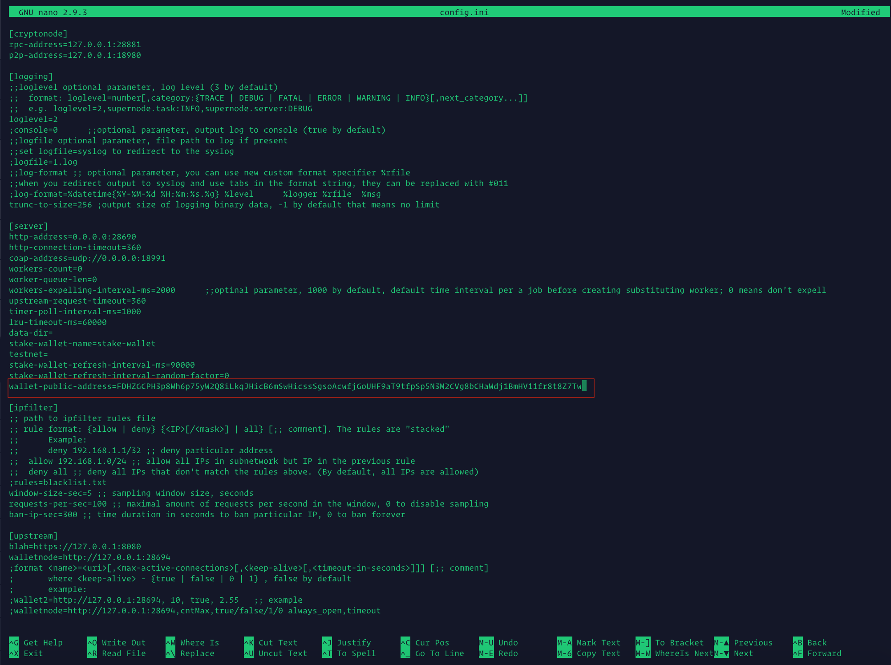
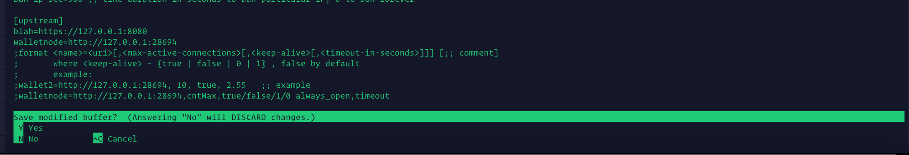
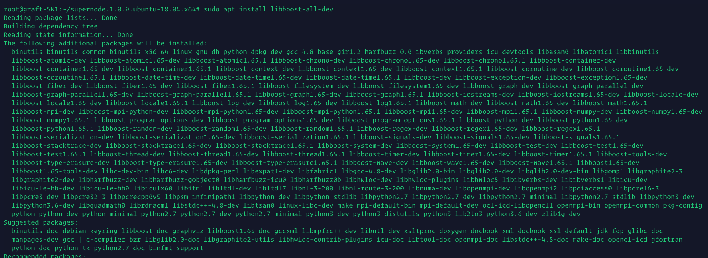
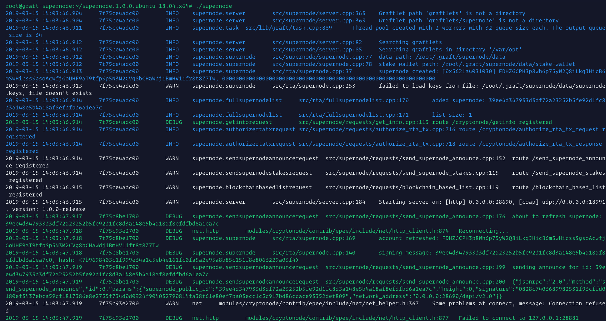
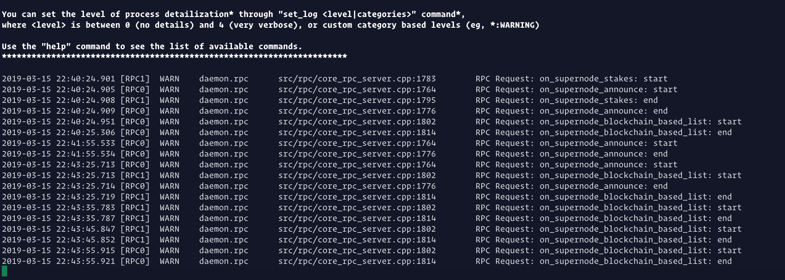
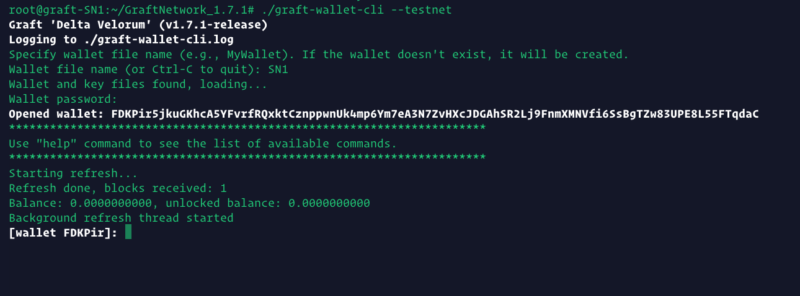
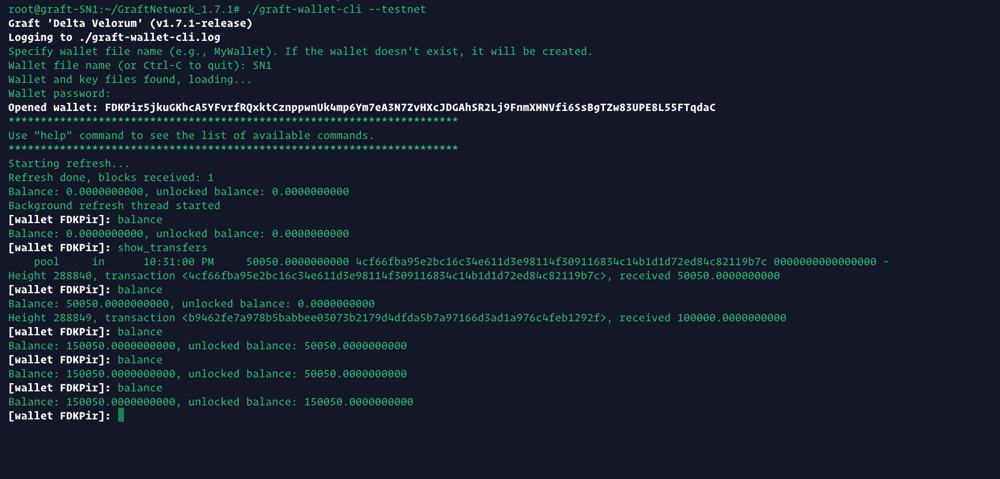
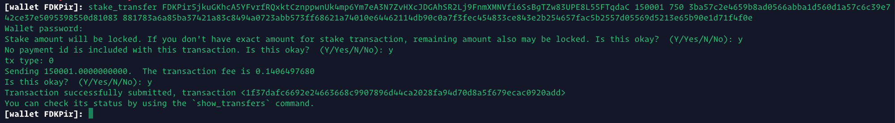

# **Graft Supernode Public Testnet v.1.7.1 - Simple step-by-step Supernode setup instructions for non-Linux users**
a.k.a - Graft: Running a Supernode for Dummies Guide


- GraftNetwork - v1.7.1 (do not use 1.7.0)
- Supernode v1.0.0

---
_by: yidakee (aka el_duderino_007)_

## General considerations

* This release is in preparation for main net launch. It will run on Public Testnet. This is different from the previous RTA Alpha testnet. If you have wallets with funds from the RTA Alpha testnet, these will not show up on Public Testnet.

* DO NOT use GraftNetwork v1.7.0 (even though some screenshots here show v1.7.0, this version had a bug that has since been patched)

* Instructions for Graft _Official Release v1.7.1 Public Testnet_ - this is not the same tesnet as previous _RTA Alpha 5.1_

* This is a bare minimum install recommended for linux newbies and troubleshooting purposes.

* This setup is **only for Testnet** - should be almost identical to main net, but I cannot predict the future. Upon main net launch, this guide will be revised/updated

* This guide is not intended for linux educational purposes, rather a simple copy/paste procedure to get your Supernode up and running and see it working properly and learn basic Supernode management, and later be able to follow more advanced setup guides.

* Things may not look _exactly_ the same on your system as the screenshots included in this document. For example, this guide is for v1.7.1, but some screenshots show 1.7.0 - simply copy/paste the commands and you should be good.

* You should setup and run the Graft software whilst logged in as a non-root user

## Requirements

* Any modern machine with at least 2GB per core, 2GB RAM - 
* Current bandwidgth consuption ~500GB - 1TB per month
* VPS (_virtual private server_) recommended.

## Brief list of VPS poviders


| URL                          | Specs     | Bandwidth | Storage| Price/month     |
| -------------                |:---------:| :--------:| :-----:| :--------------:|
| https://vultr.com            | 2vCPU 4GB | 3 TB      | 60GB   |    $20          |
| https://digitalocean.com     | 2vCPU 4GB | 4 TB      | 80GB   | $100 Free Trial |
| https://www.hetzner.com/     | 2vCPU 4GB | 20TB      | 40TB   |    4,90€        |
| https://contabo.com/         | 4 CPU 8GB | Unlimited | 200 GB |    4,99€        |
| https://www.linode.com/      | 2vCPU 4GB | 4TB       | 80GB   |    $20          |
| https://www.ovh.com/         | 2vCPU 7GB | ?         | 50GB   |    $26.40       |

* Link to Digital Ocean free $100 Trial (must provide Credit Card) - https://try.digitalocean.com/performance/

* Start by selecting a VPS provider, spin up a node selecting Ubuntu 18.04.

* Once you’ve fired up your node, `ssh` into the server and perform typical maintenance


````bash
    sudo apt-get update
````
````bash
    sudo apt-get upgrade
````




* If this window shows up, select the first option


* We will now download the latest Graft release, and then the Supernode release

````bash
    cd $HOME
    wget https://github.com/graft-project/GraftNetwork/releases/download/v1.7.1/GraftNetwork_1.7.1.ubuntu-18.04.x64.tar.gz
    wget https://github.com/graft-project/graft-ng/releases/download/v1.0.0/supernode.1.0.0.ubuntu-18.04.x64.tar.gz
````


* Lets have a look at the downloaded file. The compressed files show up in red

````bash
    ls -la
````




* Now, let's decompress the files and view the directories - these show up in blue

````bash
    tar -zxvf GraftNetwork_1.7.1.ubuntu-18.04.x64.tar.gz
    tar -zvxf supernode.1.0.0.ubuntu-18.04.x64.tar.gz
    ls -la
````


* Next, lets enter the directory where the GraftNetwork binaries where decompressed into, and have a look inside. You will see there is a `graft-supernode` binary inside - do not use this one! The actual Supernode binary is inside /root/supernode.1.0.0.ubuntu-18.04.x64/

````bash
    cd GraftNetwork_1.7.1
````
````bash
    ls -la
````


* To go back, simply issue `cd` command, and you'll be back to the main /root/ directory. 

````bash
    cd
````

Here is a handy Linux trick. Instead of writing `cd supernode.1.0.0.ubuntu-18.04.x64` try just typing `cd supe`and then press Tab. Linux is smart enough to guess what you mean and will autocomplete for you ;) 

### Great! We’ve managed to install everything.

You now have;

* `graftnonded` - syncs the blockchain, has interactive commands
* `graft-wallet-cli` - wallet management, has interactive commands
* `supernode` - RTA/supernode functions, non-interactive

These will be the only binaries you will use, do not use the others.

* We could run `graftnoded` and sync from scratch, but who wants to wait 5h doing nothing? Lets "cheat" by directly downloading the blockchain and save lots of time.

* Lets run `graftnoded` and wait a little for it to build the directories - give it 1 minute and then `exit` to stop `graftnode`

````bash
    cd GraftNetwork_1.7.1
    ./graftnoded --testnet
````


* A soon you see the bottom lines saying `Synced xxx/xxxxxx` , you can type `exit` to quit `graftnoded`

* Let's navigate to the directory where the blockchain lives in, delete the current one and download the most current up-to-date.

````bash
    cd $HOME/.graft/testnet/lmdb/
    ls -la
    rm *
    ls -la
    wget https://testnet.graft.observer/lmdb/data.mdb
````


* Big shoutout to _jagerman_ for keeping a publicly available copy of the testnet blockchain. Thanks man, you rock!


* Brilliant! Now lets go back and start `graftnoded` again, and be almost immediately up to block height.

````bash
    cd 
    cd GraftNetwork_1.7.1
    ./graftnoded --testnet
````


* Type `help` and press `Enter` to see the list of commands you can run to inspect the network. Enter `status` to double check your block height against the block explorer -> http://testnet.graft.network or jagerman's https://testnet.graft.observer

When you’re up to block height, then you can safely run wallets, any wallet. Supernodes run on cold wallet staking, so you should NOT keep your stake wallet on a live server. Especially with this barebone server setup.


* Now lets start the Supernode

* **You will need to start a new Terminal session** - if you close the current terminal window, it will kill the current process, in this case `graftnoded` - in future tutorials we will explain how to use `screen` to solve this, but for now we're keeping it simple.

* So, open a new Terminal session, `ssh` into your VPS, and enter the Supernode directory 

````bash
    cd $HOME/supernode.1.0.0.ubuntu-18.04.x64
    cd supernode.1.0.0.ubuntu-18.04.x64
    ls -la
````


* We need to edit the `config.ini` file to add in your stake wallet address - so have that handy! We will use `nano`, one of many linux text editors. Once inside the file, use your arrow key to navigate to `wallet-public-address=` and paste in your testnet stake wallet address. Remember, this is a TESTNET tutorial, so please make sure the address starts with an `F` - not NOT use a real mainnet address starting with a `G` 

````bash
    nano config.ini
````



* To save the file, look at the bottom row of the screen and press `CTRL+x` on your keyboard. It should now say `Save modified buffer?` - simply type `y` and press enter.




* Let's start the Supernode. Before we do so, lets quickly do a patch fix that should not be required in the future.

````bash
    sudo apt install libboost-all-dev
````



* Start the Supernode to get it running without stake for now, to grab some final info.

````bash
    ./supernode
````



* If you check back on `graftnoded` Terminal, you should start seeing the Supernode announcements to the network



Now literally take a 15 minute break. No, seriously, take 15 minutes to stretch your legs, make some coffee, feed your pets, water your plants etc ...  and let the Supernode start talking to its peers and collect some data for the next part. Even is your Supernode is not staked yet to receive RTA ts fees, it is still working as a proxy node.

* After 15m, let's check out your Supernoode outputs. Two ways to verify if your Supernode is healthy is by checking its peer list and ID info.

* First, lets check if the Supernode list is working right. Be sure to input your Supernode IP in the follwoing command, as per the screenshot. Don't forget the to substitute `<Your_Server_IP>` with your actual server IP.

* Open a new Terminal window! If you close the Terminal window running the Supernode, you will kill the process.

````bash
    curl --request GET http://<Your_Server_IP>:28690/debug/supernode_list/1
````


* It looks kind of weird, but that output is a positive sign. You can also use a browser to see the same output using `http://<Your_Server_IP>:28690/debug/supernode_list/1` - You won't be needing this, but is one way to check if your Supernode is working properly.

* Next, let's check the Supernode for the info we need to activate it on the network. Issue the following command, but substitute `<Your_Server_IP>` with your actual server IP. You will see the wallet address you previously configure in `config.ini` along with an ID_Key and Signature. We will need these in a bit to stake the Supernode to activate it and start earning rewards.

````bash
    curl --request GET http://<Your_Server_IP>:28690/dapi/v2.0/cryptonode/getwalletaddress
````


You can also use a browser for this, maybe it will be easier to visualize and copy/paste for the next part - funding the stake wallet!

* Alright, let's go on to create a new Public Testnet wallet and fund our Supernode! Probably a good idea to open another Terminal window.

Please keep in mind that previous RTA Testnet wallets containing funds will not show up on the Public Testnet. Also, sending from the RTA Tesntnet to the Public Tesnet won't work either. 

So best create a fresh new wallet and fund it directly. Don't forget to save the mnemonic seed for recovery if needed! Remeber, this is cold wallet staking, the wallet should not be kept on the live server. You can use a local linux machine if you have one

````bash
    cd GraftNetwork_1.7.1
    ./graft-wallet-cli --testnet 
````


* You will need to ask the admins for some Public Testnet coins. Ask in the Alpha Testnet channels on Discord (https://discord.gg/a59J3Z) or Telegram (https://t.me/joinchat/F25OCUXOQ55qqHm_BZU4Sg). In fact, in the Telegram channel there is a bot that will automatically send funds to your wallet. Simply join and ask how it's done, you'll soon find some funds going your way.

* Once the wallet has been funded and coins are unlocked, we can now proceed to stake the Supernode



* Once the coins have been unlocked, you can issue the staking command. The syntax is pretty simple.

* `stake_transfer <SUPERNODE_WALLET_PUBLIC_ADDRESS> <STAKE_AMOUNT> <LOCK_BLOCKS_COUNT> <SUPERNODE_PUBLIC_ID_KEY> <SUPERNODE_SIGNATURE>`

* Looks intimidating, but it's pretty simple. Remember a few steps back when you requested the `Supernode ID_KEY` and `Signature` ?

* To remind you, just pop this into your browser. Don't forget to change `<Your_Server_IP>` for your actual server IP

`http://<Your_Server_IP>:28690/dapi/v2.0/cryptonode/getwalletaddress`


* So now, go to your wallet and lets complete the `stake_transfer` command, In this case, I will be setting up a Tier 3 node. The ammounts does not need to be exact. Select the number of blocks you want to stake for. 720 blocks is just about 24h. Maximum is 5000 blocks = 1 week



* Now, just wait 6 blocks for the transfer to go through and your Supernode will have been activated!


### Congratulations! You've managed to get your Supernode up and running.

* Now, just sit back and relax. Soon enough you will start earning Supernode rewards!

* Next stop - real Main Net with real Graft coming soon!

* Don't forget to join us on the Alpha Testnet channels on Discord (https://discord.gg/a59J3Z) or Telegram (https://t.me/joinchat/F25OCUXOQ55qqHm_BZU4Sg) to get the most up to date news!

* yidakee out (for now).


