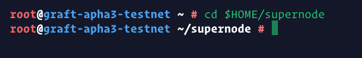

# **Simple step-by-step Supernode setup instructions for non-Linux users**
---
This is the formal version of the `Alpha3 Supernode Guide for Dummies` by yidakee (@el_duderino_007) dedicated to the Community Tree development branch of Graft Network.

**_This is not an official guide to be used with the main development branch_**

## General considerations

* This is a bare minimum install recommended for linux newbies and troubleshooting purposes.

* This setup is **not recommended for mainnet**, as it is very a insecure server setup.

* This guide is not intended for linux educational purposes, rather a simple copy/paste procedure to get your Supernode up an running and see it working properly and learn Supernode management, and later be able to follow more advanced setup guides.

## Requirements

* Any modern machine with at least 2 GB per core.
* VPS (_virtual private server_) recommended.
* Unlimited bandwidth - current implementation consumes roughly 15GB/day.

## Brief list of VPS poviders

>| URL           | Specs         | Bandwidth | Storage | Price/month  |
| ------------- |:-------------:| :-------------:| :-----:| :-----:|
| https://vultr.com | 2vCPU 4GB | 3 TB | 60GB | $20 |
| https://try.digitalocean.com | 2vCPU 4GB| 4 TB | 80GB     |   $100 Free Trial |
| https://www.hetzner.com/ | 2vCPU 4GB | 20TB  | 40TB    |    4,90€|
| https://contabo.com/ | 4 CPU 8GB | Unlimited | 200 GB      |    4,99€ |
| https://www.linode.com/ |2vCPU 4GB | 4TB | 80GB      |    $20 |
| https://www.ovh.com/ | 2vCPU 7GB | ?  | 50GB    |    $26.40 |

* Start by selecting a VPS provider, spin up a node selecting Ubuntu 18.04. The Community Dev Tree accepts other distributions, but for this guide we will focus on Ubuntu 18.04.

* Once you’ve fired up your node, `ssh` into the server and perform typical maintenance (note, it may not look exactly the same on your machine)

    sudo apt-get update

    sudo apt-get upgrade

* If this window shows up, select the first option

* We will now install git

    sudo apt-get install -y git

* Clone Community Tree Graft Supernode testnet code from GitHub repository

      git clone --recursive https://github.com/graft-community/graft-ng.git

* Enter the graft-ng directory

    cd graft-ng

* Switch over to the alpha3 branch

    git checkout alpha3

* Update submodules

    git submodule update --init --recursive

* Install dependencies

    sudo apt-get -y install build-essential cmake pkg-config libboost-all-dev libssl-dev autoconf automake check libpcre3-dev rapidjson-dev libreadline-dev

* Get back out of “graft-ng” directory, create a build directory, and enter it - this is where the actual Graft source code will be built.

    cd
    mkdir -p supernode
    cd supernode

* Run “cmake” in this directory, using the source code

    cmake -DENABLE_SYSLOG=ON $HOME/graft-ng

* Build the source code. This can take a while! (1h or more)

    make

### Great! We’ve managed to install everything.
You now have;

* `graftnonded` - syncs the blockchain, has interactive commands
* `graft-wallet-cli` - wallet management, has interactive commands
* `graft_serverg - RTA/supernode functions, non-interactive

>`Graftnoded` and `graft-wallet-cli` both live inside the directory; `$Home/supernode/BUILD/bin/`

>`graft_server` lives in;
`$HOME/supernode/

* You should already be inside of the supernode directory, but in any case, lets cd directly into it:

    cd $HOME/supernode/BUILD/bin

* First, lets run graftnoded and wait until it syncs up the blockchain - this may take a long time. Hours even. There is a faster way by downloading a boostrapped version containing the blockchain as well as other Supernode watch-only wallets. This will be covered later on. For now, lets do it th good old fashion way.

    ./graftnoded --testnet

* Once finished, it will look like this

* Type `help` and press `Enter` to see the list of commands you can run to inspect the network. Check with `status` to double check your block height

* When you’re up to block height, then you can safely run wallets, any wallet. But we need to create a specific wallet for your SuperNode, and send the staking amount to it.

* The easiest way is to run `graft_server` for a few seconds, and then stopping the process. It will create a stake-wallet automatically.

* **You will need to create a new Terminal** - if you close the terminal window, it will kill the current process, in this case `graftnoded` - in future tutorials we will explain how to use `screen` to solve this, but for now we're keeping it simple.

* So, open a new Terminal session and

    cd supernode
    ./graft_server

* Give is a brief few seconds, 5-10s, and then quit by CTRL+C, to stop the supernode graft_server.

* Let’s open the stake-wallet to find the address to send funds to. By opening the wallet, you will be able to retrieve the mnemonic seed phrase for safe keeping. The actual stake-wallet is created in a hidden folder, here is how to access it;

    cd $HOME/supernode/BUILD/bin
    ./graft-wallet-cli --wallet-file ~/.graft/supernode/data/stake-wallet/stake-wallet --password "" --testnet --trusted-daemon

* Here you can type `help` too, to see all the command you can perform within the wallet, like for example `show_transfers`.

* Copy the wallet address, make sure it is a **testnet** address and starts with an **F**. Send the amount needed for the tiered node you wish to run, and wait until the balance is unlocked. If you don’t have testnet GRFT, ask ~~the dev team~ in the testnet chat channel on Discord (https://discord.gg/a59J3Z) or Telegram (https://t.me/joinchat/F25OCUXOQ55qqHm_BZU4Sg)

### **Never ever use your mainnet wallet with real mainnet GRFT.**
 

* Check your funds with `balance` and/or `refresh`

Once your balance is unlocked, can now start the supernode in the next step.

* Exit the wallet (or create a new Terminal session), navigate to the `$HOME/supernode` directory and start `graft_server`

    CTRL + C  (or type Exit)
    cd $HOME/supernode
    ./graft_server

You should start seeing something like:

If you check back on the `graftnoded` Terminal, you will see this going on, as `graftnoded` and `graft_server` are now talking to each other;

It is normal to see these errors. The `graft_server` is processing blocks to get up to speed with the network. Let it run, it is quite intensive. You will start progressively seeing more good announces like this;

Eventually, after quite some time, it will finish. Let it run. Some terminal emulators may even appear to be stuck or hanging. After some time, RPC Request: on_supernode_announce: start and end should prevail.

#### Congratulations!
You have a fully functioning Supernode live on Alpha 3 testnet, and should start getting rewards soon.

You can now experiment with the Point-Of-Sale wallet to create some items, as well as the RTA Alpha testnet wallet - and see for yourself how RTA works. If all is well configured, should take 4 to 8 seconds to conclude a sale.

You can go into all your testnet wallet's settings and point them to your own supernode, for maximum efficiency of transaction processing. Simply add your Supernode IP and port 28690. This can also be configured through a URL using HTTPS.

Here is an extremely basic network monitoring tool I made, to make tesnet a little more visually appealing;

https://docs.google.com/spreadsheets/d/1MsPxWJkCBE4ElCy37TNuOtbX4SypPzbq5L6wCHpkN84/edit#gid=688880943

Also, here is Jason’s (a.k.a jagerman) testnet block explorer

https://rta.graft.observer

Have fun, and try to break stuff. Don’t forget to submit any findings!
